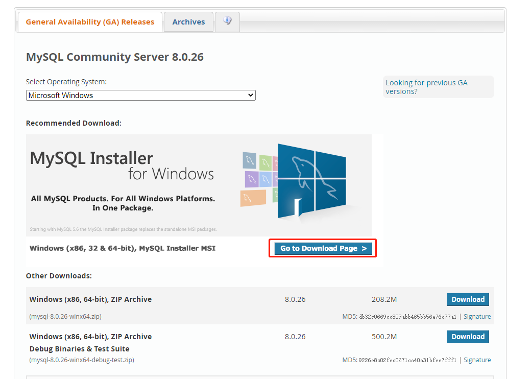
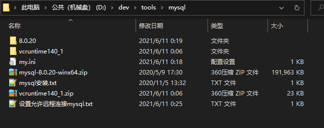
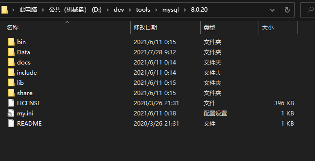
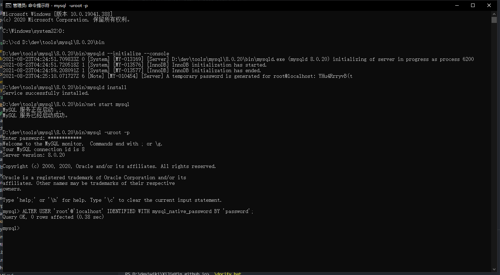
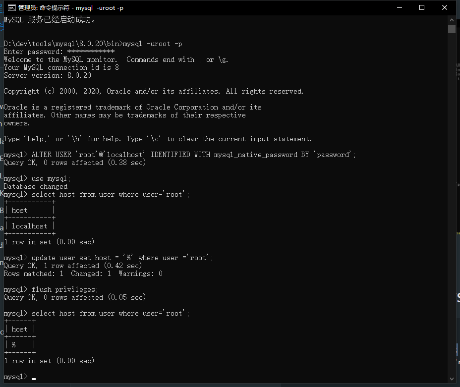

# [MySQL 数据库](https://www.mysql.com/)
<svg t="1629789601455" class="icon" viewBox="0 0 1024 1024" version="1.1" xmlns="http://www.w3.org/2000/svg" p-id="25925" width="100" height="100"><path d="M416.853 616.96v95.147h-56.746c-18.347-0.427-20.054-10.667-19.627-14.934V616.96h-38.4c0.853 0.853 0 81.067 0 82.773 0.427 16.64 21.333 31.147 54.613 31.574h59.734v1.28c0 3.413 2.56 15.36-19.2 17.92H302.08v19.2h99.84c16.64-0.427 53.333-4.267 52.907-33.707V616.96zM266.24 563.2c-27.307-8.533-45.227-1.28-53.76 17.493L158.293 702.72l-52.48-122.453c-5.973-14.08-17.92-21.334-34.986-20.907a71.253 71.253 0 0 0-18.774 3.413c-11.52 3.414-17.066 10.24-17.066 23.894V730.88h38.4v-140.8l52.906 120.32c6.4 14.933 15.36 20.48 32.854 20.48s26.026-5.547 32.853-20.48l52.907-117.333V730.88h37.973V587.093c0.427-13.653-5.12-20.48-16.64-23.893z" fill="#017590" p-id="25926"></path><path d="M474.027 597.76v23.467c0 16.64 14.506 30.293 46.506 33.706H569.6c21.333 0 19.2 16.64 19.2 19.2v19.2a17.92 17.92 0 0 1-19.2 19.2h-95.573v19.2H569.6a82.347 82.347 0 0 0 34.133-7.253c16.214-7.253 22.614-17.493 22.614-30.293V666.88c0-29.44-36.267-30.293-57.174-30.293H531.2c-14.933 0-17.493-8.96-19.2-19.2v-19.2c1.707-7.68 5.12-17.92 18.347-19.2h96v-19.2h-90.454c-14.933 0-61.866 1.706-61.866 37.973z m342.613 95.147V597.76c0-20.053-13.227-34.133-41.387-37.973h-92.16c-28.16 3.84-37.973 17.92-37.973 37.973v95.147c0 18.346 10.24 29.866 31.573 35.413a72.107 72.107 0 0 0 19.627 2.987h67.413l21.334 19.2h43.093l-29.44-26.454c13.653-5.973 17.92-14.933 17.92-31.146z m-41.387 9.813l-10.24-9.387H721.92l21.333 19.2h-37.12a23.04 23.04 0 0 1-22.613-19.2v-93.44a21.333 21.333 0 0 1 22.613-20.906H755.2a24.747 24.747 0 0 1 23.467 19.2s0.426 88.746 0.426 95.146a12.373 12.373 0 0 1-3.84 9.387z m125.44 9.387c-19.626 0-26.453-8.107-26.453-20.054V559.787h-37.973V692.48c0 23.04 13.226 35.84 47.36 38.4h104.96v-19.2z" fill="#F49214" p-id="25927"></path><path d="M692.907 317.867a43.52 43.52 0 0 0-10.667 1.28h0.427a75.52 75.52 0 0 0 8.106 10.24l5.547 12.373h0.427a14.507 14.507 0 0 0 5.12-12.8c-1.28-1.28-1.707-3.413-2.987-5.12s-4.267-3.84-5.973-5.973z" fill="#017590" p-id="25928"></path><path d="M866.133 489.387c3.84 5.12 19.2 8.106 26.027 11.093a160.427 160.427 0 0 1 17.493 6.827c8.96 5.12 17.494 11.52 25.6 17.493s16.64 9.387 17.494 14.507c-20.48-0.427-36.267 1.28-49.494 6.826-3.84 1.707-9.813 1.707-10.666 6.4s2.56 5.547 3.84 8.107a64.853 64.853 0 0 0 13.226 15.787c5.12 3.84 10.667 8.106 16.214 11.52s21.333 9.386 30.72 15.786 11.52 8.107 17.066 12.374 4.694 5.12 8.107 6.4c-1.707-2.56-2.133-5.547-3.84-8.107l-7.68-7.68a124.587 124.587 0 0 0-26.88-25.6c-8.107-5.547-25.6-13.653-29.013-22.613h-0.427a121.173 121.173 0 0 0 17.493-4.267c8.96-2.133 16.64-1.707 25.6-3.84l12.374-3.413v-2.56c-4.694-4.694-7.68-10.667-12.8-14.934a370.773 370.773 0 0 0-41.814-31.573c-8.106-5.12-18.346-8.533-26.88-12.8s-8.106-2.133-9.813-4.693a121.6 121.6 0 0 1-10.667-19.627 706.414 706.414 0 0 1-20.906-44.373 238.933 238.933 0 0 0-12.8-29.014c-26.454-43.52-55.04-69.546-98.987-95.573-9.387-5.547-20.48-7.68-32.427-10.24l-19.2-1.28a97.28 97.28 0 0 1-11.52-8.96c-8.96-5.547-27.306-15.787-42.24-15.787a20.053 20.053 0 0 0-20.906 13.227c-6.827 16.64 10.24 32.853 16.213 41.387a126.293 126.293 0 0 1 12.8 19.2c2.133 4.266 2.133 8.96 3.84 13.226a348.587 348.587 0 0 0 16.64 34.987 117.76 117.76 0 0 0 9.387 15.787c2.133 2.986 5.973 4.266 6.4 8.533s-3.84 12.8-5.974 19.2c-8.96 28.587-5.546 64.427 7.68 85.333 4.267 6.4 13.654 20.48 26.88 15.36s8.96-19.2 12.374-32c0.853-2.986 0.426-5.12 1.706-6.826l10.24 20.906a145.92 145.92 0 0 0 33.28 34.56c5.974 4.694 10.667 12.374 18.774 14.934h-0.427c-1.28-2.56-3.84-3.414-5.973-5.12a128.853 128.853 0 0 1-13.227-15.36 344.32 344.32 0 0 1-28.587-46.507c-4.266-7.68-7.68-16.64-11.093-24.32s-1.28-7.68-4.267-9.387c-3.84 5.974-9.386 10.667-12.373 17.494s-5.12 24.32-6.827 38.4h-1.28c-8.106-2.134-11.093-10.24-14.08-17.494a109.653 109.653 0 0 1-2.133-68.266c1.707-5.547 9.387-22.614 6.4-27.307s-6.4-7.68-9.387-11.52a87.893 87.893 0 0 1-9.386-16.213c-6.4-14.08-11.947-30.72-18.774-44.8a126.72 126.72 0 0 0-12.8-19.627c-4.693-6.827-10.24-11.52-14.08-19.627s-2.986-7.253-1.28-10.24a4.693 4.693 0 0 1 3.414-3.413c3.413-2.56 12.8 0.853 16.213 2.133a143.787 143.787 0 0 1 25.173 12.8c3.84 2.56 7.68 7.254 12.374 8.96h5.12c8.106 1.707 17.493 0.427 25.173 2.987a149.76 149.76 0 0 1 36.693 17.493 226.133 226.133 0 0 1 80.214 85.76c2.986 5.974 4.266 11.52 7.253 17.494s11.947 25.173 17.493 37.12a170.667 170.667 0 0 0 17.92 34.56z" fill="#017590" p-id="25929"></path></svg>
> MySQL 是一个关系型数据库管理系统，由瑞典 MySQL AB 公司开发，目前属于 Oracle 公司。MySQL 是一种关联数据库管理系统，关联数据库将数据保存在不同的表中，而不是将所有数据放在一个大仓库内，这样就增加了速度并提高了灵活性。

- MySQL 是开源的，目前隶属于 Oracle 旗下产品。
- MySQL 支持大型的数据库。可以处理拥有上千万条记录的大型数据库。
- MySQL 使用标准的 SQL 数据语言形式。
- MySQL 可以运行于多个系统上，并且支持多种语言。这些编程语言包括 C、C++、Python、Java、Perl、PHP、Eiffel、Ruby 和 Tcl 等。
- MySQL 对 PHP 有很好的支持，PHP 是目前最流行的 Web 开发语言。
- MySQL 支持大型数据库，支持 5000 万条记录的数据仓库，32 位系统表文件最大可支持 4GB，64 位系统支持最大的表文件为 8TB。
- MySQL 是可以定制的，采用了 GPL 协议，你可以修改源码来开发自己的 MySQL 系统。

# [下载](https://dev.mysql.com/downloads/mysql/)

  
  

这里我选择的是离线安装（下载会比较慢，有条件的同学，可以开个[VPN](https://github.com/getlantern/lantern)啥的），除了下载mysql的安装包，可能还需要下载一些运行库，运行库，具体要看电脑的情况，看mysql安装时提示，少什么就装什么！

# 安装
下载完后解压mysql-8.0.20-winx64.zip
  
修改my.ini配置文件，用于初始化mysql数据库的配置

my.ini

``` ini
[mysqld]
#设置3306端口
port=3306
#设置mysql的安装目录
basedir=D:\\dev\\tools\\mysql\\8.0.20
#设置mysql数据库的数据的存放目录
datadir=D:\\dev\\tools\\mysql\\8.0.20\\Data
#允许最大连接数
max_connections=200
#允许连接失败的次数。
max_connect_errors=10
#服务端使用的字符集默认为utf8mb4
character-set-server=utf8mb4
#创建新表时将使用的默认存储引擎
default-storage-engine=INNODB
#默认使用“mysql_native_password”插件认证
#mysql_native_password
default_authentication_plugin=mysql_native_password
[mysql]
#设置mysql客户端默认字符集
default-character-set=utf8mb4
[client]
#设置mysql客户端连接服务端时默认使用的端口
port=3306
default-character-set=utf8mb4
```

将my.ini文件放到mysql目录


1、初始化，用管理员的身份运行cmd，进入到mysql bin 目录  
mysqld --initialize --console  
2、安装  
mysqld install  
3、启动服务  
net start mysql  
4、登陆  
mysql -uroot -p  
这里要输入密码，就是上面安装步骤mysql自动生成的密码，所以为了方便，我们把这个密码改成一个自己好记的密码  
<mark>**或者也只可以把上面的密码保存起来，不要丢了！！！**</mark>  
5、修改密码  
ALTER USER 'root'@'localhost' IDENTIFIED WITH mysql_native_password BY 'password';  

*安装过程*


到这一步，root的账号密码更新为password

# 设置允许远程连接mysql

``` sql
use mysql;
select host from user where user='root';
update user set host = '%' where user ='root';
flush privileges;
```

至此已经可以用navicat访问 ip:port 端口了


