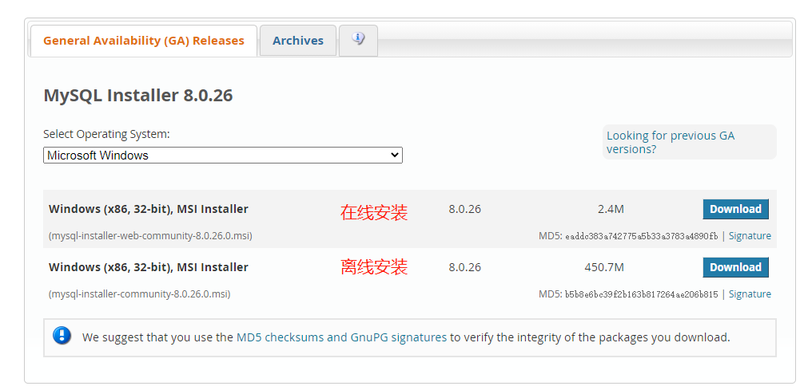

# [MySQL 数据库](https://www.mysql.com/)

> MySQL 是一个关系型数据库管理系统，由瑞典 MySQL AB 公司开发，目前属于 Oracle 公司。MySQL 是一种关联数据库管理系统，关联数据库将数据保存在不同的表中，而不是将所有数据放在一个大仓库内，这样就增加了速度并提高了灵活性。

- MySQL 是开源的，目前隶属于 Oracle 旗下产品。
- MySQL 支持大型的数据库。可以处理拥有上千万条记录的大型数据库。
- MySQL 使用标准的 SQL 数据语言形式。
- MySQL 可以运行于多个系统上，并且支持多种语言。这些编程语言包括 C、C++、Python、Java、Perl、PHP、Eiffel、Ruby 和 Tcl 等。
- MySQL 对 PHP 有很好的支持，PHP 是目前最流行的 Web 开发语言。
- MySQL 支持大型数据库，支持 5000 万条记录的数据仓库，32 位系统表文件最大可支持 4GB，64 位系统支持最大的表文件为 8TB。
- MySQL 是可以定制的，采用了 GPL 协议，你可以修改源码来开发自己的 MySQL 系统。

# [下载](https://dev.mysql.com/downloads/mysql/)

  
  

这里我选择的是离线安装（下载会比较慢，有条件的同学，可以开个[VPN](https://github.com/getlantern/lantern)啥的），除了下载mysql的安装包，可能还需要下载一些运行库，运行库，具体要看电脑的情况，看mysql安装时提示，少什么就装什么！

# 安装
下载完后解压mysql-8.0.20-winx64.zip
  
修改my.ini配置文件，用于初始化mysql数据库的配置

my.ini

``` ini
[mysqld]
#设置3306端口
port=3306
#设置mysql的安装目录
basedir=D:\\dev\\tools\\mysql\\8.0.20
#设置mysql数据库的数据的存放目录
datadir=D:\\dev\\tools\\mysql\\8.0.20\\Data
#允许最大连接数
max_connections=200
#允许连接失败的次数。
max_connect_errors=10
#服务端使用的字符集默认为utf8mb4
character-set-server=utf8mb4
#创建新表时将使用的默认存储引擎
default-storage-engine=INNODB
#默认使用“mysql_native_password”插件认证
#mysql_native_password
default_authentication_plugin=mysql_native_password
[mysql]
#设置mysql客户端默认字符集
default-character-set=utf8mb4
[client]
#设置mysql客户端连接服务端时默认使用的端口
port=3306
default-character-set=utf8mb4
```

将my.ini文件放到mysql目录


1、初始化，用管理员的身份运行cmd，进入到mysql bin 目录  
mysqld --initialize --console  
2、安装  
mysqld install  
3、启动服务  
net start mysql  
4、登陆  
mysql -uroot -p  
这里要输入密码，就是上面安装步骤mysql自动生成的密码，所以为了方便，我们把这个密码改成一个自己好记的密码  
<mark>**或者也只可以把上面的密码保存起来，不要丢了！！！**</mark>  
5、修改密码  
ALTER USER 'root'@'localhost' IDENTIFIED WITH mysql_native_password BY 'password';  

*安装过程*


到这一步，root的账号密码更新为password

# 设置允许远程连接mysql

``` sql
use mysql;
select host from user where user='root';
update user set host = '%' where user ='root';
flush privileges;
```

至此已经可以用navicat访问 ip:port 端口了


