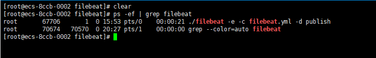

# [Beats](https://www.elastic.co/cn/beats/ "beats")

<!-- TOC depthfrom:2 -->

- [简介](#%E7%AE%80%E4%BB%8B)
- [安装](#%E5%AE%89%E8%A3%85)
- [日志分析](#%E6%97%A5%E5%BF%97%E5%88%86%E6%9E%90)

<!-- /TOC -->

## 简介

Beats 是一个免费且开放的平台，集合了多种单一用途数据采集器。它们从成百上千或成千上万台机器和系统向 Logstash 或 Elasticsearch 发送数据。
>所以其实可以不需要logstash也能做到日志收集，直接推送到Elasticsearch就行了，推到Logstash是因为，Logstash能够从多个来源采集数据，转换数据，然后将数据发送到您最喜欢的“存储库”中。

---

## 安装

1.[官方下载](https://www.elastic.co/cn/downloads/beats/)  
这里我们选择使用filebeat  


2.选择自己系统对应的版本（我这里下载的是linux的版本）  

3.下载来后是一个tar.gz的压缩包  
filebeat-7.14.0-linux-x86_64.tar.gz


[解压命令](https://www.runoob.com/linux/linux-comm-tar.html)

```bash
tar -xzvf filebeat-7.14.0-linux-x86_64.tar.gz
mkdir -p /zhsq/app/ELK/filebeat
mv filebeat-*/ /zhsq/app/ELK/filebeat
cd /zhsq/app/ELK/filebeat
```

4.修改配置文件

```bash
vim filebeat.yml
```

配置文件：

```yaml
filebeat.inputs:
# xiaobai-cs-cloud-other
# 开启log类型
- type: log
  enable: true
  #指定日志路径，可用*通配符，这里的意思是，所有的日志都归为 info level
  paths:
    - /zhsq/app/xiaobai-cs-cloud-other/logs/xiaobai-cs-cloud-other/*.log
  #自定义字段，可以用来做区分日志类型，日志产生的模块等
  fields:
    modules: xiaobai-cs-cloud-other
    level: info
  #设置每10秒钟搜索一次日志，这个按需设置
  scan_frequency: 10s

- type: log
  enable: true
  paths:
    - /zhsq/app/xiaobai-cs-cloud-other/logs/xiaobai-cs-cloud-other/error*.log
  fields:
    modules: xiaobai-cs-cloud-other
    level: error
  scan_frequency: 10s
#
# device-cloud-support-kss
- type: log
  enable: true
  paths:
    - /zhsq/app/device-cloud-support-kss/logs/device-cloud-support-kss/*.log
  fields:
    modules: device-cloud-support-kss
    level: info
  scan_frequency: 10s

- type: log
  enable: true
  paths:
    - /zhsq/app/device-cloud-support-kss/logs/device-cloud-support-kss/error*.log
  fields:
    modules: device-cloud-support-kss
    level: error
  scan_frequency: 10s
###省略其他模块的配置
#模板设置，这里可以设置分片
setup.template.settings:
  index.number_of_shards: 1
  #index.codec: best_compression
  #_source.enabled: false
#setup.kibana:
  #host: "localhost:5601"
#output.elasticsearch:
  #hosts: ["172.16.0.189:9200"]
  #protocol: "https"
  #api_key: "id:api_key"
  #username: "elastic"
  #password: "changeme"
#配置输出到 logstash
output.logstash:
  # The Logstash hosts
  hosts: ["172.16.0.189:5044"]  
processors:
  - add_host_metadata:
      when.not.contains.tags: forwarded
  - add_cloud_metadata: ~
  - add_docker_metadata: ~
  - add_kubernetes_metadata: ~
```

5.修改完保存，回到logstash目录，创建启动文件，启动程序

```bash
cd /zhsq/app/ELK/filebeat
vim run.sh
nohup ./filebeat -e -c filebeat.yml -d "publish" >nohup.out 2>&1 &
chmod a+x run.sh
sh ./run.sh
```

6.查看是否启动成功

```bash
ps -ef | grep filebeat
```



---

## 日志分析

访问http://ip:5601 登录kibana  
这时我们就可以看到我们的日志被推上了elasticsearch  


1.创建索引模式


2.Discover


