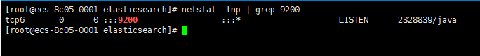
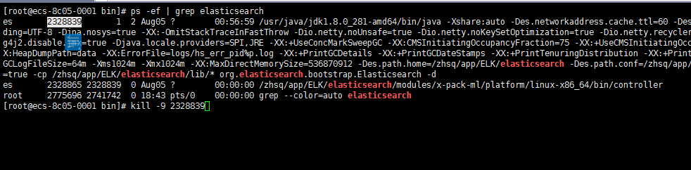
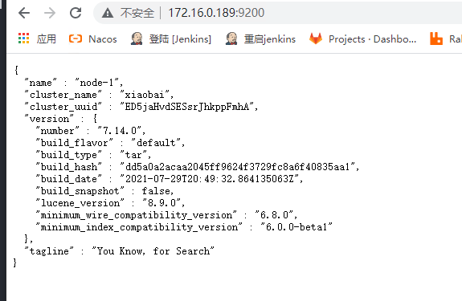

# [ElasticSearch](https://www.elastic.co/cn/elasticsearch/ "ElasticSearch")

**无论您正在查找来自特定 IP 地址的活动，还是正在分析交易请求数量为何突然飙升，或者正在方圆一公里内搜寻美食店，我们尝试解决的这些问题归根结底都是搜索。通过 Elasticsearch，您可以轻松地存储、搜索和分析大量数据。**
<!-- TOC depthfrom:2 -->

- [简介](#%E7%AE%80%E4%BB%8B)
- [安装](#%E5%AE%89%E8%A3%85)
- [初始化ElasticSearch用户](#%E5%88%9D%E5%A7%8B%E5%8C%96elasticsearch%E7%94%A8%E6%88%B7)

<!-- /TOC -->

## 1.简介

Elasticsearch 是一个分布式、RESTful 风格的搜索和数据分析引擎，能够解决不断涌现出的各种用例。 作为 Elastic Stack 的核心，它集中存储您的数据，帮助您发现意料之中以及意料之外的情况。  

---

## 2.安装

1.[官方下载](https://www.elastic.co/cn/downloads/elasticsearch)  
2.选择自己系统对应的版本（我这里下载的是linux的版本）  

3.下载下来后是一个.tar.gz的压缩包  
elasticsearch-7.14.0-linux-x86_64.tar.gz  


[解压命令](https://www.runoob.com/linux/linux-comm-tar.html)

```bash
tar -xzvf elasticsearch-7.14.0-linux-x86_64.tar.gz
mkdir -p /zhsq/app/ELK/elasticsearch
mv elasticsearch-*/ /zhsq/app/ELK/elasticsearch
cd /zhsq/app/ELK/elasticsearch
```

4.修改配置文件

```bash
cd config
vim elasticsearch.yml
```

配置文件：

``` yaml
#集群名
cluster.name: elastic
#当前节点名
node.name: node-1
#ES文档地址
path.data: /zhsq/app/ELK/ESDocument/data
#ES日志文件地址
path.logs: /zhsq/app/ELK/ESDocument/logs
#ip地址，用于 kibana 和 Logstash
network.host: 172.16.0.189
#配置允许其他机器允许
http.host: 0.0.0.0
#http端口
http.port: 9200
#tpc端口
transport.tcp.port: 9300
#集群节点（es最好是要有三个节点，也就是三个es服务组成的集群）
discovery.seed_hosts: ["172.16.0.189"]
#设置主节点（这里也是，所有的节点都是主节点，互为主节点）
cluster.initial_master_nodes: ["node-1"]
# 配置允许其他软件调用http接口，防止跨域
http.cors.enabled: true
http.cors.allow-origin: "*"
http.cors.allow-headers: Authorization
node.master: true
node.data: true
# security 
xpack.security.enabled: true
xpack.license.self_generated.type: basic
xpack.security.transport.ssl.enabled: true
```

5.修改完保存，回到es目录，创建启动文件，启动程序

```bash
cd /zhsq/app/ELK/elasticsearch
vim run.sh
nohup ./bin/elasticsearch -d >/dev/null 2>&1 &
chmod a+x run.sh
sh ./run.sh
```

6.查看是否启动成功

```bash
netstat -lnp | grep 9200
```



---

## 初始化ElasticSearch用户

1.初始化密码

```bash
cd /zhsq/app/ELK/elasticsearch/bin
./elasticsearch-setup-passwords interactive
```

要为这些账号设置密码

| 用户名 | 密码
| --------: | :-------
| apm_system | apm_system@gxinfo
| kibana_system | kibana_system@gxinfo
| kibana | kibana@gxinfo
| logstash_system | logstash_system@gxinfo
| beats_system | beats_system@gxinfo
| remote_monitoring_user | remote_monitoring_user@gxinfo
| elastic | elastic@gxinfo

这里统一密码为

>*用户名@gxinfo*，

例如

>*elastic/elastic@gxinfo*

2.设置完之后，重启一下es

```bash
ps -ef | grep elasticsearch
kill -9 pid
cd /zhsq/app/ELK/elasticsearch/
sh ./run.sh
```



然后，网页打开，有弹窗需要输入账号密码，说明初始化用户成功


登录成功  


