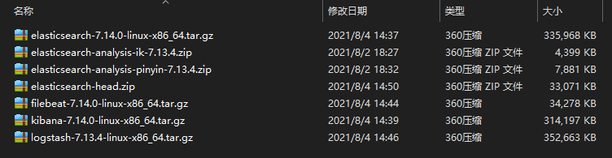

# [Elastic Stack（Elasticsearch、Logstash、Kibana、Beats）](https://www.elastic.co/cn/what-is/elk-stack)

<!-- TOC depthfrom:2 -->

- [简介](#%E7%AE%80%E4%BB%8B)
    - [一切都起源于 Elasticsearch…](#%E4%B8%80%E5%88%87%E9%83%BD%E8%B5%B7%E6%BA%90%E4%BA%8E-elasticsearch)
    - [引入 Logstash 和 Kibana，产品更强大](#%E5%BC%95%E5%85%A5-logstash-%E5%92%8C-kibana%E4%BA%A7%E5%93%81%E6%9B%B4%E5%BC%BA%E5%A4%A7)
    - [社区越来越壮大，用例越来越丰富](#%E7%A4%BE%E5%8C%BA%E8%B6%8A%E6%9D%A5%E8%B6%8A%E5%A3%AE%E5%A4%A7%E7%94%A8%E4%BE%8B%E8%B6%8A%E6%9D%A5%E8%B6%8A%E4%B8%B0%E5%AF%8C)
    - [然后我们向 ELK 中加入了 Beats](#%E7%84%B6%E5%90%8E%E6%88%91%E4%BB%AC%E5%90%91-elk-%E4%B8%AD%E5%8A%A0%E5%85%A5%E4%BA%86-beats)
    - [那么，ELK 需要怎么变化呢？](#%E9%82%A3%E4%B9%88elk-%E9%9C%80%E8%A6%81%E6%80%8E%E4%B9%88%E5%8F%98%E5%8C%96%E5%91%A2)
    - [总结](#%E6%80%BB%E7%BB%93)
- [准备工作](#%E5%87%86%E5%A4%87%E5%B7%A5%E4%BD%9C)
    - [下载搭建所需要的软件（这里以linux搭建为例，windows类似）](#%E4%B8%8B%E8%BD%BD%E6%90%AD%E5%BB%BA%E6%89%80%E9%9C%80%E8%A6%81%E7%9A%84%E8%BD%AF%E4%BB%B6%E8%BF%99%E9%87%8C%E4%BB%A5linux%E6%90%AD%E5%BB%BA%E4%B8%BA%E4%BE%8Bwindows%E7%B1%BB%E4%BC%BC)

<!-- /TOC -->

## 简介

什么是 ELK Stack？很简单，指的就是 Elastic Stack。  
“ELK”是三个开源项目的首字母缩写，这三个项目分别是：Elasticsearch、Logstash 和 Kibana。Elasticsearch 是一个搜索和分析引擎。Logstash 是服务器端数据处理管道，能够同时从多个来源采集数据，转换数据，然后将数据发送到诸如 Elasticsearch 等“存储库”中。Kibana 则可以让用户在 Elasticsearch 中使用图形和图表对数据进行可视化。

### 一切都起源于 Elasticsearch…

这个开源的分布式搜索引擎基于 JSON 开发而来，具有 RESTful 风格。它使用简单，可缩放规模，十分灵活，因此受到用户的热烈好评，而且如大家所知，围绕这一产品还形成了一家专门致力于搜索的公司。  

### 引入 Logstash 和 Kibana，产品更强大

Elasticsearch 的核心是搜索引擎，所以用户开始将其用于日志用例，并希望能够轻松地对日志进行采集和可视化。有鉴于此，我们引入了强大的采集管道 Logstash 和灵活的可视化工具 Kibana。  

### 社区越来越壮大，用例越来越丰富

无论是在混乱如麻的文本型文档中找到前 N 个结果，还是分析安全事件，再或是自由地对指标进行切片和切块，全球社区一直都在使用 ELK 不断地拓展使用范围。  

### 然后我们向 ELK 中加入了 Beats

“我只想对某个文件进行 tail 操作，”用户表示。我们用心倾听。在 2015 年，我们向 ELK Stack 中加入了一系列轻量型的单一功能数据采集器，并把它们叫做 Beats。  

### 那么，ELK 需要怎么变化呢？

ELK 这个名称又要变了，的确如此。把它叫做 BELK？BLEK？ELKB？当时的确有过继续沿用首字母缩写的想法。然而，对于扩展速度如此之快的堆栈而言，一直采用首字母缩写的确不是长久之计。  

__就这样，Elastic Stack 这个名字应运而生了__

### 总结

Elastic Stack 就是 ELK Stack，但是更加灵活，可以帮助人们出色完成各项事务。  

## 准备工作

### [下载搭建所需要的软件](https://www.elastic.co/cn/start)（这里以linux搭建为例，windows类似）

