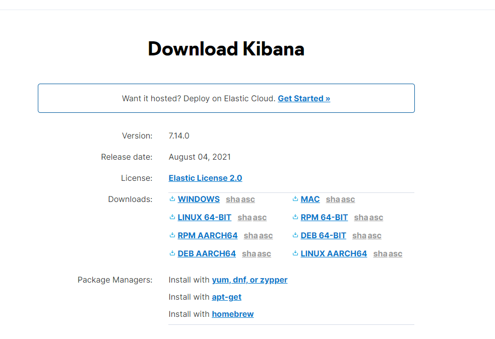
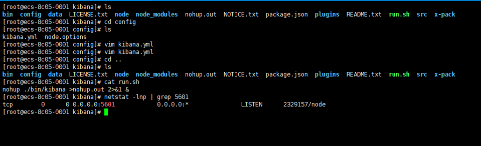

# [Kibana](https://www.elastic.co/cn/kibana/ "Kibana")
<!-- TOC depthfrom:2 -->

- [简介](#%E7%AE%80%E4%BB%8B)
- [安装](#%E5%AE%89%E8%A3%85)

<!-- /TOC -->

## 简介

Kibana 是一个免费且开放的用户界面，能够让您对 Elasticsearch 数据进行可视化，并让您在 Elastic Stack 中进行导航。您可以进行各种操作，从跟踪查询负载，到理解请求如何流经您的整个应用，都能轻松完成。

---

## 安装

1.[官方下载](https://www.elastic.co/cn/downloads/kibana)
2.选择自己系统对应的版本（我这里下载的是linux的版本）  

3.下载来后是一个tar.gz的压缩包  
kibana-7.14.0-linux-x86_64.tar.gz


[解压命令](https://www.runoob.com/linux/linux-comm-tar.html)

```bash
tar -xzvf kibana-7.14.0-linux-x86_64.tar.gz
mkdir -p /zhsq/app/ELK/kibana
mv kibana-*/ /zhsq/app/ELK/kibana
cd /zhsq/app/ELK/kibana
```

4.修改配置文件

```bash
cd config
vim kibana.yml
```

配置文件：

```yaml
#配置ip地址，或者允许其他机器访问
server.host: "0.0.0.0"
#配置es的地址
elasticsearch.hosts: ["http://172.16.0.189:9200"]
#配置连接es的账号（elastic是超级角色）
elasticsearch.username: "elastic"
#配置连接es的密码
elasticsearch.password: "elastic@gxinfo"
#配置简体中文
i18n.locale: "zh-CN"
```

5.修改完保存，回到kibana目录，创建启动文件，启动程序

```bash
cd /zhsq/app/ELK/kibana
vim run.sh
nohup ./bin/kibana >nohup.out 2>&1 &
chmod a+x run.sh
sh ./run.sh
```

6.查看是否启动成功

```bash
netstat -lnp | grep 5601
```



页面访问 http://ip:5601


