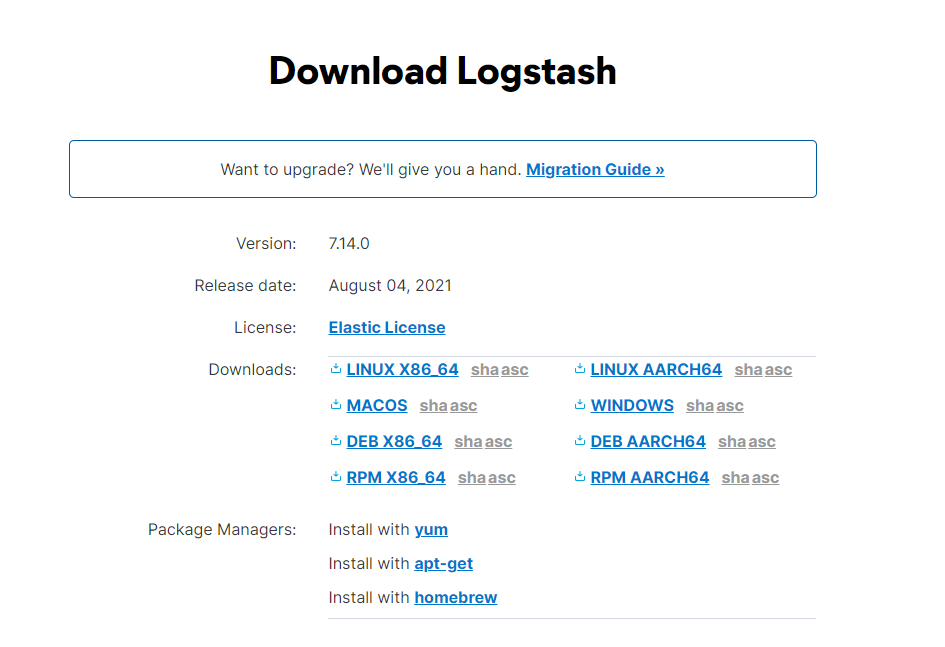
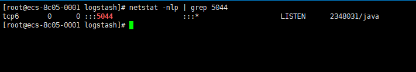

# [Logstash](https://www.elastic.co/cn/logstash/ "Logstash")

<!-- TOC depthfrom:2 -->

- [简介](#%E7%AE%80%E4%BB%8B)
- [安装](#%E5%AE%89%E8%A3%85)

<!-- /TOC -->

## 简介

Logstash 是免费且开放的服务器端数据处理管道，能够从多个来源采集数据，转换数据，然后将数据发送到您最喜欢的“存储库”中。

---

## 安装

1.[官方下载](https://www.elastic.co/cn/downloads/logstash)
2.选择自己系统对应的版本（我这里下载的是linux的版本）  

3.下载来后是一个tar.gz的压缩包  
logstash-7.14.0-linux-x86_64.tar.gz


[解压命令](https://www.runoob.com/linux/linux-comm-tar.html)

```bash
tar -xzvf logstash-7.14.0-linux-x86_64.tar.gz
mkdir -p /zhsq/app/ELK/logstash
mv logstash-*/ /zhsq/app/ELK/logstash
cd /zhsq/app/ELK/logstash
```

4.修改配置文件

```bash
cd config
vim first-pipeline.conf
```

配置文件：

```
#配置监听所有发送到logstash（端口5044） 的beats的消息
input {
        beats {
                port => "5044"
        }
}
filter {
        #COMBINEDAPACHELOG 是logstash自带的匹配模式
        #内置的正则，用来匹配apache access日志
        grok {
                match => { "message" => "%{COMBINEDAPACHELOG}"}
        }
        # 定位
        geoip {
                source => "clientip"
        }
}
output {
        #控制台输出
        #stdout { codec => rubydebug }
        #这里做了判断，fields.modules 是在Filebeat里面自定义的参数
        #用于判断是哪个系统的 我这里是用不同的两个系统 
        #=~
        #这里可以用[]拿出所有消息里面的数据，用于做判断
        if[fields][modules] =~ "xiaobai-cs-cloud-"{
                #elasticsearch配置
                elasticsearch {
                        #elasticsearch地址
                        hosts => [ "172.16.0.189:9200" ]
                        #指定修改索引，一天一个，方便后期维护，删掉不需要的索引
                        index => "logstash-xiaobai-cs-cloud-%{+YYYY.MM.dd}"
                        #elasticsearch账号
                        user => "elastic"
                        #elasticsearch密码
                        password => "elastic@gxinfo"
                }
        }
        if[fields][modules] =~ "device-cloud-"{
                elasticsearch {
                        hosts => [ "172.16.0.189:9200" ]
                        index => "logstash-device-cloud-%{+YYYY.MM.dd}"
                        user => "elastic"
                        password => "elastic@gxinfo"
                }
        }

}
```

5.修改完保存，回到logstash目录，创建启动文件，启动程序

```bash
cd /zhsq/app/ELK/logstash
vim run.sh
nohup ./bin/logstash -f ./config/first-pipeline.conf --config.reload.automatic >nohup.out 2>&1 &
chmod a+x run.sh
sh ./run.sh
```

>--config.reload.automatic选项的意思是启用自动配置加载，以至于每次你修改完配置文件以后无需停止然后重启Logstash

6.查看是否启动成功

```bash
netstat -lnp | grep 5044
```



>logstash只有控制台，但是我们是要把数据推到elasticsearch上去的，所以这里把控制台关掉了
