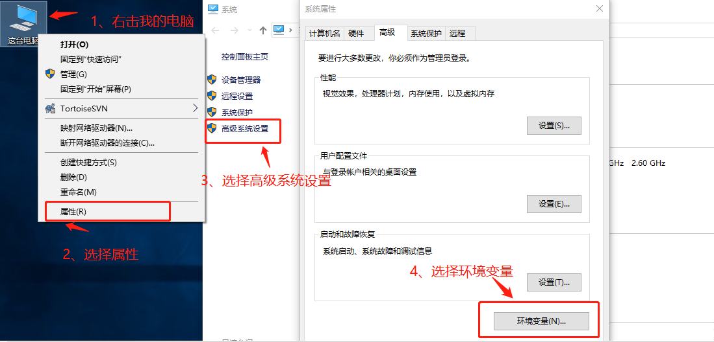
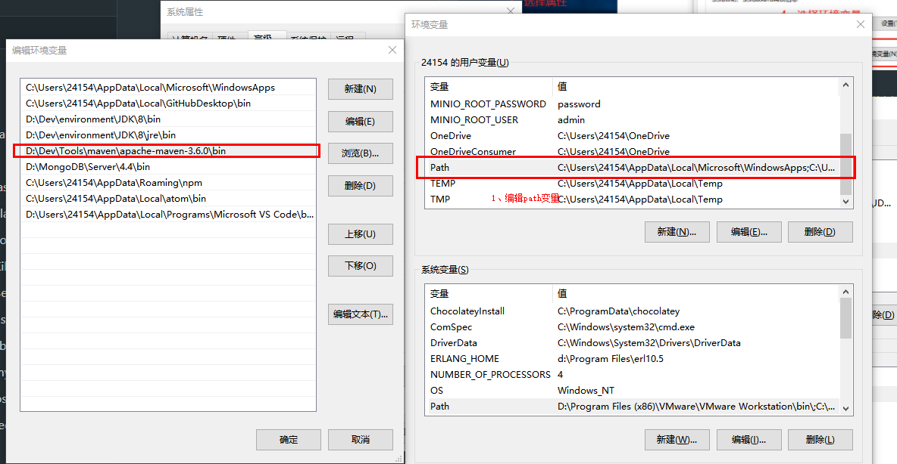
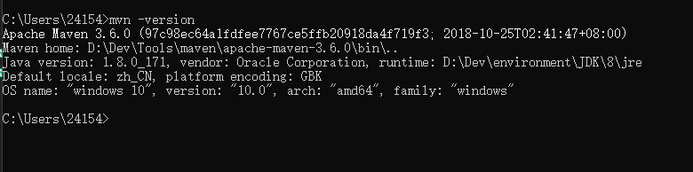
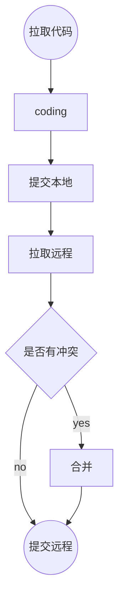

# 简介

运维一般是指对大型组织已经建立好的网络软硬件的维护，其中传统的运维是指信息技术运维（IT 运维）。所谓 IT 运维管理，是指单位 IT 部门采用相关的方法、手段、技术、制度、流程和文档等，对 IT 运行环境（如软硬件环境、网络环境等）、IT 业务系统和 IT 运维人员进行的综合管理。随着信息化进程的推进，运维管理会覆盖对整个组织运行，进行支持的管理信息系统涵盖的所有内容，除了传统的 IT 运维，还拓展了业务运维和日常管理运维。业务运维面向整个组织提供各业务系统的问题受理、响应、处理和转交等方面的服务；日常管理运维面向整个组织提供针对各业务系统的运行状态和需求变化和不同的记录、跟踪、保存、分析方面的管理。

- 保障业务系统长期稳定运行  
  毕竟业务系统要是出现一点差错，用户就要投诉，所以运维工程师最核心的工作就是保证业务系统能够稳定运行。
  首先要知道业务跑在什么上，一般来说网站服务器都是 nginx、apache 等，依赖 mysql 数据库进行数据储存，依靠 PHP 进行解析，所以运维工程师必须掌握 LNMP、LAMP 等环境部署的知识。
- 保障数据安全可靠  
  数据安全是公司领导最看重的部分，运维工程师也要保证数据的安全性和可靠性，要是出了一点点错误，领导就要找运维喝茶了。  
  有时候需要手动改数据库的内容，就要学会掌握 mysql 数据库的增删查改知识；  
  有时候需要应对数据库的服务器硬件坏了，就需要 Mysql 主从复制以备不时之需；  
  有时候需要还原数据库，就需要学会 mysql 增量备份和恢复，以还原到指定的时间点；  
  有时候定时备份还不够，就需要使用 rsync+inotify 来实时备份；  
  有时候为了增加服务器安全性，就要通过 iptables 来控制公司的 IP 或者跳板机 IP 访问权限；
- 构建监控报警体系  
  运维工程师常用的是 zabbix、nagios 来进行报警监控，如果没有监控运维就是瞎子，所以要先构建报警监控体系，此后就要解决系统故障。一般来说，常见的故障有应用故障、数据库故障、网线故障等等，有的是软件故障，有时候是硬件故障，而一个有经验的运维工程师能在第一时间定位故障原因。
- 技术与业务问题处理  
  这里有两个核心的问题，分别是技术问题和业务问题，技术问题主要需要网络抓包分析、tcpdump 抓包分析和代理机制等等内容；而业务问题就比技术要复杂一些了，比如业务层面的数据分析，不光要统计出业务的各种指标数据，还要对数据进行分析解剖，找出业务问题的所在。
- 版本测试与上线  
  这也是运维工程师的常见工作内容，负责版本的测试与上线，开发人员发布版本之前，运维工程师需要进行性能和功能测试；此外在版本上线的时候，最好也在晚间业务量较小的时候上线，可以避免上线压力过大。

总结  
运维和开发是两个截然不同的方向。如果做运维的话，有开发的底子那么转岗位也不是不可以。
运维负责具体的产品线运维工作，同时也需要掌握开发的能力，深入业务，最了解业务的痛点和问题，同时研发/优化针对产品业务需求的平台、工具和手段，能够接触到各类优秀的系统架构并有能力做出优劣对比，同时对业务的掌控决定了相应运维工程师在业务发展中的作用。

身为一个开发在这里高呼：~~**运%……维￥@就@#&8 是￥……（开……&发）的（&&#爹！**~~

运维所需要知道的一些东西

<!-- tabs:start -->

#### **CentOS7/8**

[官网下载](https://www.centos.org/)  
如果没有趁机，可以使用[WMware](https://www.vmware.com/asean/products/workstation-pro/workstation-pro-evaluation.html)安装来测试

#### **Shell**

[Shell](https://www.runoob.com/linux/linux-shell.html)

### **Crontab**

[Crontab](https://www.runoob.com/linux/linux-comm-crontab.html)

#### **Nginx**

[Nginx 配置详解](https://www.runoob.com/w3cnote/nginx-setup-intro.html)  
[Nginx 服务器安装及配置文件详解](https://www.runoob.com/w3cnote/nginx-install-and-config.html)

##### nginx 通用配置

```conf
user  www www;
worker_processes  2;
error_log  logs/error.log;
#error_log  logs/error.log  notice;
#error_log  logs/error.log  info;
pid        logs/nginx.pid;
events {
    use epoll;
    worker_connections  2048;
}
http {
    include       mime.types;
    default_type  application/octet-stream;
    #log_format  main  '$remote_addr - $remote_user [$time_local] "$request" '
    #                  '$status $body_bytes_sent "$http_referer" '
    #                  '"$http_user_agent" "$http_x_forwarded_for"';
    #access_log  logs/access.log  main;
    sendfile        on;
    # tcp_nopush     on;
    keepalive_timeout  65;
  # gzip压缩功能设置
    gzip on;
    gzip_min_length 1k;
    gzip_buffers    4 16k;
    gzip_http_version 1.0;
    gzip_comp_level 6;
    gzip_types text/html text/plain text/css text/javascript application/json application/javascript application/x-javascript application/xml;
    gzip_vary on;

  # http_proxy 设置
    client_max_body_size   10m;
    client_body_buffer_size   128k;
    proxy_connect_timeout   75;
    proxy_send_timeout   75;
    proxy_read_timeout   75;
    proxy_buffer_size   4k;
    proxy_buffers   4 32k;
    proxy_busy_buffers_size   64k;
    proxy_temp_file_write_size  64k;
    proxy_temp_path   /usr/local/nginx/proxy_temp 1 2;
  # 设定负载均衡后台服务器列表
    upstream  backend  {
              #ip_hash;
              server   192.168.10.100:8080 max_fails=2 fail_timeout=30s ;
              server   192.168.10.101:8080 max_fails=2 fail_timeout=30s ;
    }
  # 很重要的虚拟主机配置
    server {
        listen       80;
        server_name  itoatest.example.com;
        root   /apps/oaapp;
        charset utf-8;
        access_log  logs/host.access.log  main;
        #对 / 所有做负载均衡+反向代理
        location / {
            root   /apps/oaapp;
            index  index.jsp index.html index.htm;
            proxy_pass        http://backend;
            proxy_redirect off;
            # 后端的Web服务器可以通过X-Forwarded-For获取用户真实IP
            proxy_set_header  Host  $host;
            proxy_set_header  X-Real-IP  $remote_addr;
            proxy_set_header  X-Forwarded-For  $proxy_add_x_forwarded_for;
            proxy_next_upstream error timeout invalid_header http_500 http_502 http_503 http_504;

        }
        #静态文件，nginx自己处理，不去backend请求tomcat
        location  ~* /download/ {
            root /apps/oa/fs;

        }
        location ~ .*/.(gif|jpg|jpeg|bmp|png|ico|txt|js|css)$
        {
            root /apps/oaapp;
            expires      7d;
        }
           location /nginx_status {
            stub_status on;
            access_log off;
            allow 192.168.10.0/24;
            deny all;
        }
        location ~ ^/(WEB-INF)/ {
            deny all;
        }
        #error_page  404              /404.html;
        # redirect server error pages to the static page /50x.html
        #
        error_page   500 502 503 504  /50x.html;
        location = /50x.html {
            root   html;
        }
    }
  ## 其它虚拟主机，server 指令开始
}
```

##### docker 安装 nginx

安装最新版本

```bash
docker pull nginx:latest
```

运行容器

```bash
docker run --name nginx-test -p 8080:80 -d nginx
```

参数说明：

- --name nginx-test：容器名称。
- -p 8080:80： 端口进行映射，将本地 8080 端口映射到容器内部的 80 端口。
- -d nginx： 设置容器在在后台一直运行。

启动一个容器

```bash
docker run -d --name nginx nginx
```

查看 容器 获取容器 ID 或直接使用名字

```bash
docker container ls
```

在当前目录下创建目录：conf

```bash
mkdir conf
```

拷贝容器内 Nginx 默认配置文件到本地当前目录下的 conf 目录（$PWD 当前全路径）

```bash
docker cp nginx:/etc/nginx/nginx.conf $PWD/conf
docker cp nginx:/etc/nginx/conf.d $PWD/conf
```

停止容器

```bash
docker container stop nginx
```

删除容器

```bash
docker container rm nginx
```

在当前目录下创建目录：html 放静态文件

```bash
mkdir html
```

部署容器

```bash
docker run -d -p 80:80 \
 -p 443:443 \
 --name nginxweb \
 -v /zhsq/soft/nginx/html:/usr/share/nginx/html \
 -v /zhsq/soft/nginx/conf/nginx.conf:/etc/nginx/nginx.conf \
 -v /zhsq/soft/nginx/conf/conf.d:/etc/nginx/conf.d \
 -v /zhsq/soft/nginx/logs:/var/log/nginx \
 nginx
```

- -d # 表示在一直在后台运行容器
- -p 80:80 # 对端口进行映射，将本地 8081 端口映射到容器内部的 80 端口
- --name # 设置创建的容器名称
- -v # 将本地目录(文件)挂载到容器指定目录；
- --link answer-server:answerserver 这计划是指需要转向本机 docker 容器的别名

静态文件夹（部署前端）：/zhsq/soft/nginx/html  
代理配置文件夹（nginx）：/zhsq/soft/nginx/conf/nginx.conf

#### **Jenkins**

[Jenkins 官网](https://www.jenkins.io/zh/)

#### **Maven**

[maven 下载安装](https://maven.apache.org/download.cgi)
[maven repository](https://mvnrepository.com/)

maven 配置，国内访问 maven 的速度慢，所以建议添加阿里云镜像

```xml
<?xml version="1.0" encoding="UTF-8"?>
<settings xmlns="http://maven.apache.org/SETTINGS/1.0.0"
          xmlns:xsi="http://www.w3.org/2001/XMLSchema-instance"
          xsi:schemaLocation="http://maven.apache.org/SETTINGS/1.0.0 http://maven.apache.org/xsd/settings-1.0.0.xsd">
  <localRepository>d:/data/maven/repo</localRepository>
  <pluginGroups>
  </pluginGroups>
  <proxies>
  </proxies>
  <servers>
  </servers>
  <mirrors>
    <mirror>
      <id>alimaven</id>
      <name>aliyun maven</name>
      <url>http://maven.aliyun.com/nexus/content/groups/public/</url>
      <mirrorOf>central</mirrorOf>
    </mirror>
  </mirrors>
  <profiles>
  </profiles>
</settings>
```

配置环境变量  
1、打开系统环境变量

2、把maven安装路径的bin目录添加进去path里面

3、查看是否安装成功


#### **SVN**


#### **Git**

[git简明](https://www.runoob.com/manual/git-guide/)  



#### **Docker**

[Build once, Run anywhere!](https://www.docker.com/)

#### **VMware**

[WMware](https://www.vmware.com/asean/products/workstation-pro/workstation-pro-evaluation.html)

<!-- tabs:end -->
