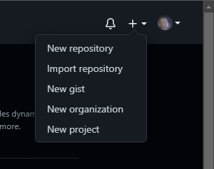
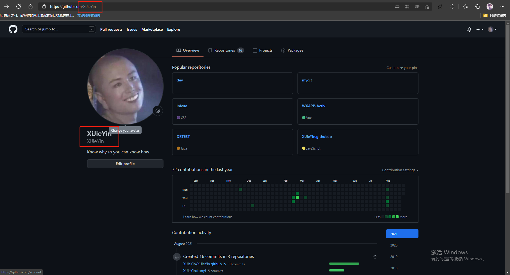
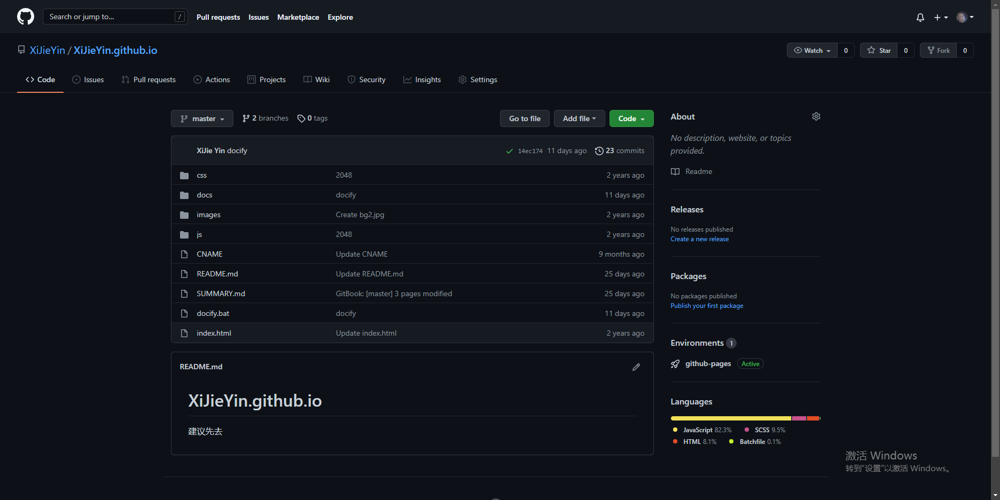
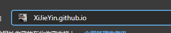
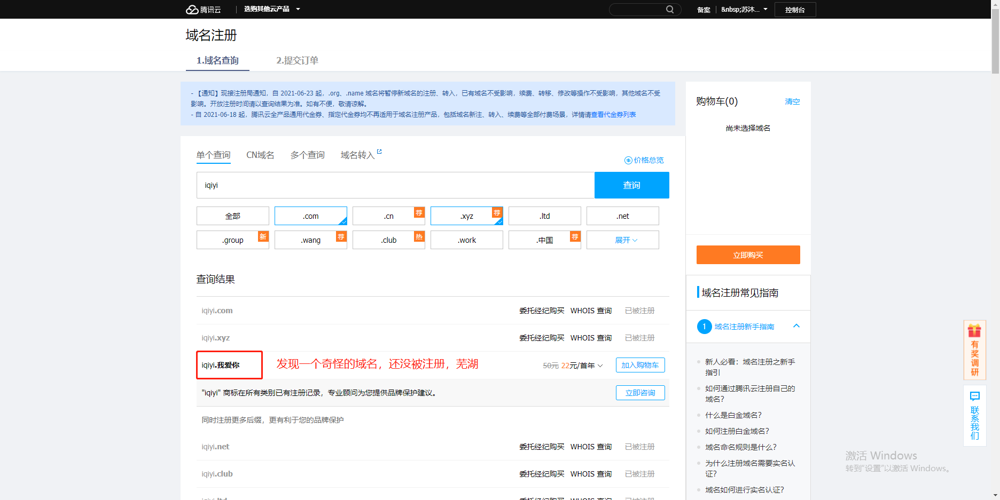
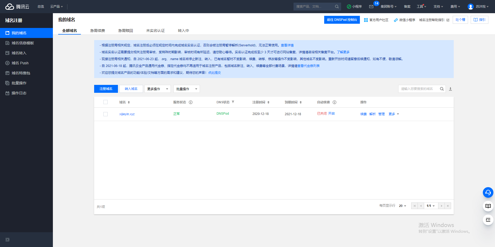
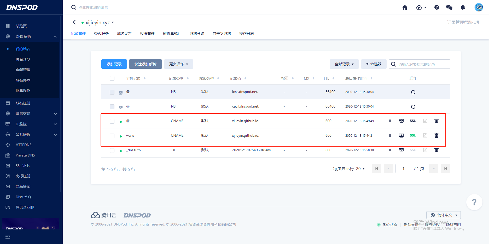
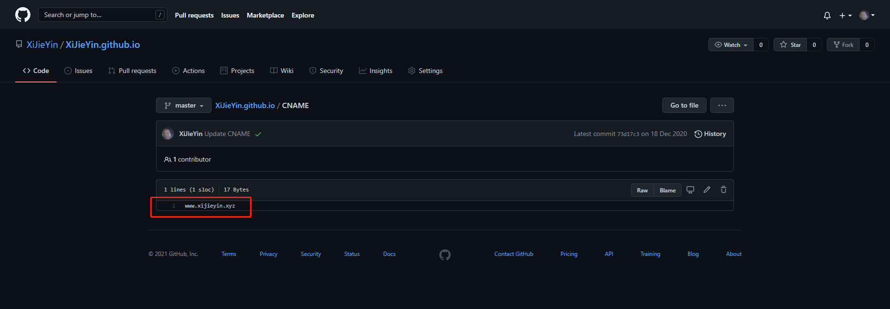

# 如何利用github白嫖一个自己的静态网站

<!-- TOC -->

- [如何利用github白嫖一个自己的静态网站](#如何利用github白嫖一个自己的静态网站)
      - [需要用到](#需要用到)
      - [步骤](#步骤)

<!-- /TOC -->

#### 需要用到

- github账号
- 一个自己的域名
- docify
- markdown语法
- 一点前端知识 html,css,js
- 任意支持markdown的编译器

#### 步骤
废话不多说。

- 注册github
  你需要去 [github](https://github.com/) 创建一个账号，注册账号这种事情，也没什么好说的，对着步骤一步一步来就行了  
- 建仓库
  你需要先创建一个仓库

    

  这里要注意，这个仓库的名字是有要求的  

    

  一定要以你的用户名开头  

    

  github.io 来结尾
- 验证
  建好仓库后，可以验证一下  

    

  先随便丢一点静态的页面到这个仓库下面  

    

  然后浏览器地址栏输入你的仓库的名，看看是不是能正常访问你的静态页面了，当然到这一步，其实就已对实现了我们要的静态网站了，爸特，github.io，总感觉有点不太对劲。所以这里可以把自己的域名绑定上这个github.io
- 注册域名
  去腾讯云，或者阿里云，随便哪里，买一个域名  

    

  我买的是我自己的名字的域名，当时活动一块钱买的，lucky ~ "\^_^" ~  

    
- 域名解析
  到这一步了都，懂的大佬应该都懂了。
  点这个解析，进去域名解析页面  

    

  添加如下两个解析地址，这里如果要使用到https的也可以考虑自己搞个SSL证书什么的，不过这个要搞还得等他审核
- 添加CNAME
  在你的仓库下载添加一个CNAME的文件（没有后缀不是什么CNAME.txt）  

    
  
  这个文件，可以让你自定义的域名去重定向你的 GitHub Pages
- 编写文档
  这里我使用的是 [docify](https://docsify.js.org/#/zh-cn/) ，简约不简单，很好用的一个文档工具，全程markdown，就很舒服。至于怎么使用，官方文档写得很清楚了，这里就不多BB了，可以自行点链接去看。然后就是这里推荐还是用 vscode 来写这个markdown 的文档，毕竟，vscode 用的人多，生态好，插件多。

这里提供一下我的文档的地址，供参考 [https://github.com/XiJieYin/XiJieYin.github.io/tree/docs](https://github.com/XiJieYin/XiJieYin.github.io/tree/docs)
