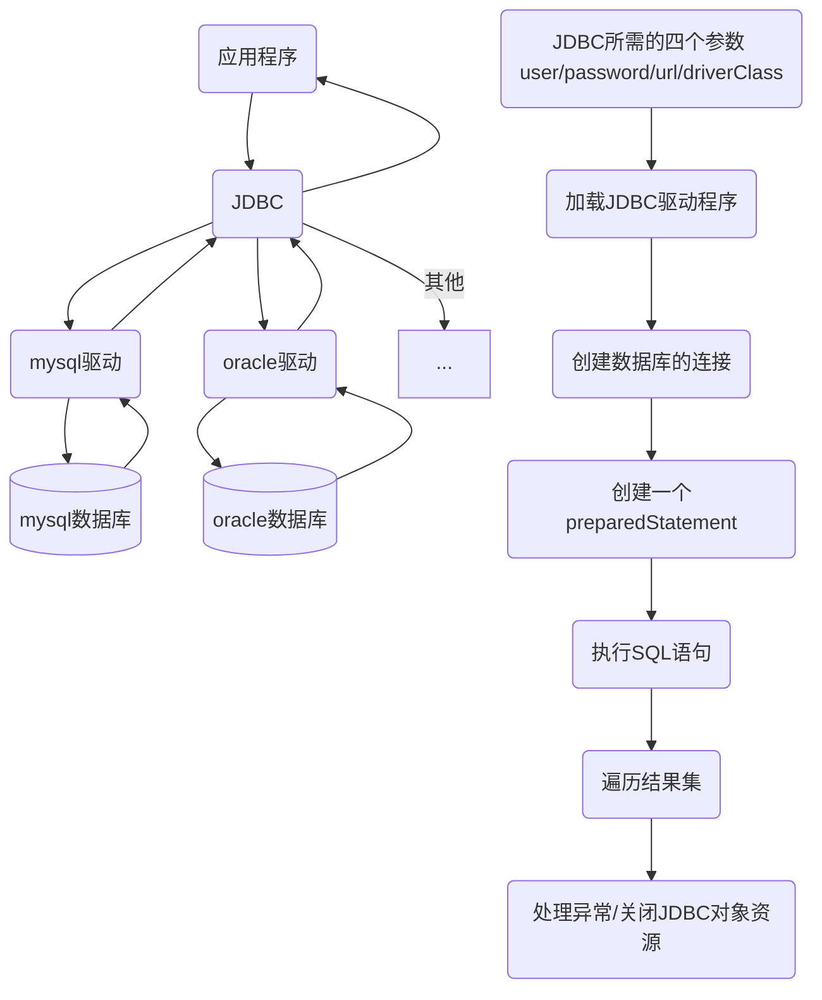

> 后端===枯燥无味

<!-- tabs:start -->

#### **Spring**

#### **Alibaba**

#### **持久层**

ORM 持久层 指的是：**将业务数据存储到磁盘，也具备长期存储能力，只要磁盘不损坏，如果在断电情况下，重启系统仍然可以读取数据**

JDBC、[MyBatis](https://mybatis.org/mybatis-3/zh/index.html)/[MyBatis-Plus](https://mp.baomidou.com/)、Hibernate...

##### 1、JDBC

- 什么是 jdbc
  JDBC（JavaDataBase Connectivity）就是 Java 数据库连接, 说的直白点就是使用 Java 语言操作数据库，本来我们是通过控制台或客户端操作的数据库, JDBC 是用 Java 语言来发送 SQL 语句。
- Jdbc 原理

##### 2、MyBatis

- 什么是 MyBatis？  
  MyBatis 是一款优秀的持久层框架，它支持自定义 SQL、存储过程以及高级映射。MyBatis 免除了几乎所有的 JDBC 代码以及设置参数和获取结果集的工作。MyBatis 可以通过简单的 XML 或注解来配置和映射原始类型、接口和 Java POJO（Plain Old Java Objects，普通老式 Java 对象）为数据库中的记录。

#### **序列化**

JSON、KRYO

- JSON 就是 {} []

#### **其他**

[Thymeleaf](https://www.thymeleaf.org/)、[Beetl](http://ibeetl.com/)、Servlet/JSP、[POI（EasyPoi）](http://easypoi.mydoc.io/)、Netty、websocket、Struts2、Swagger

<!-- tabs:end -->
