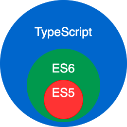

# 前端 （网站前台部分）

> 前端即网站前台部分，运行在 PC 端，移动端等浏览器上展现给用户浏览的网页。随着互联网技术的发展，HTML5，CSS3，前端框架的应用，跨平台响应式网页设计能够适应各种屏幕分辨率，合适的动效设计，给用户带来极高的用户体验。

# 网站前端

> 前端技术一般分为前端设计和前端开发，前端设计一般可以理解为网站的视觉设计，前端开发则是网站的前台代码实现，包括基本的 HTML 和 CSS 以及 JavaScript/ajax，最新的高级版本 HTML5、CSS3，以及 SVG 等。

# 核心技术

**HTML、CSS、JavaScript**
这三个是前端开发中最基本也是最必须的三个技能。前端的开发中，在页面的布局时， HTML 将元素进行定义，CSS 对展示的元素进行定位，再通过 JavaScript 实现相应的效果和交互。虽然表面看起来很简单，但这里面需要掌握的东西绝对不会少。在进行开发前，需要对这些概念弄清楚、弄明白，这样在开发的过程中才会得心应手。

# 一些好用的网站

- [w3school](https://www.w3school.com.cn/index.html "前端基础篇")
- [jq22](https://www.jq22.com/ "jquery的一些你可能用得上的插件，在这里能找到")
- [iconfont](https://www.iconfont.cn/ "阿里巴巴矢量图标库")
- [Font Awesome](https://fontawesome.com/ "矢量图标集和工具包")
- [Font Awesome中文网](http://www.fontawesome.com.cn/ "Font Awesome中文网")

# html(骨架)、css(皮肤)、js(神经)

<!-- tabs:start -->

#### **HTML**

<svg t="1629787504988" class="icon" viewBox="0 0 1927 1024" version="1.1" xmlns="http://www.w3.org/2000/svg" p-id="2449" width="100" height="100"><path d="M1751.04 102.4q34.816 0 66.048 13.312t54.784 36.352 36.864 54.272 13.312 66.048l0 491.52q0 35.84-13.312 66.56t-36.864 54.272-54.784 36.864-66.048 13.312l-1584.128 0q-35.84 0-66.56-13.312t-54.272-36.864-36.864-54.272-13.312-66.56l0-491.52q0-34.816 13.312-66.048t36.864-54.272 54.272-36.352 66.56-13.312l1584.128 0zM508.928 287.744l-62.464 0 0 194.56-192.512 0 0-194.56-65.536 0 0 453.632 65.536 0 0-188.416 192.512 0 0 188.416 62.464 0 0-453.632zM894.976 289.792l-320.512 0 0 68.608 128 0 0 384 64.512 0 0-384 128 0 0-68.608zM1408 289.792l-101.376 0-117.76 332.8-128-332.8-100.352 0 0 453.632 61.44 0 0-330.752 120.832 330.752 76.8 0 124.928-324.608 0 324.608 63.488 0 0-453.632zM1794.048 676.864l-193.536 0 0-385.024-63.488 0 0 451.584 257.024 0 0-66.56z" p-id="2450"></path></svg>
<svg t="1629787380916" class="icon" viewBox="0 0 1024 1024" version="1.1" xmlns="http://www.w3.org/2000/svg" p-id="1198" width="100" height="100"><path d="M116.7 63.8l71.9 806.9 322.8 89.6 323.7-89.8 72.1-806.7H116.7z m634 263.9H372l9 101.3h360.7l-27.2 303.8-203 56.3-202.7-56.3-13.9-155.4h99.4l7.1 79 110.2 29.7 0.3-0.1L622 656.3 633.5 528h-343l-26.7-299.2h495.7l-8.8 98.9z" fill="#E44D26" p-id="1199"></path></svg>

指的是超文本标记语言 (Hyper Text Markup Language)，这个也是我们网页最常用普通的语言了，经历了多个版本的发展，已经发展到 5.0 版了，得力于 W3C 建立的标准和规范，已普遍升级到了 XHTML，XHTML 指可扩展超文本标签语言（EXtensible HyperText Markup Language）， XHTML 于 2000 年的 1 月 26 日成为 W3C 标准，是更严格更纯净的 HTML 代码，XHTML 的目标是取代 HTML。XHTML 与 HTML 4.01 几乎是相同的，XHTML 是作为一种 XML 应用被重新定义的 HTML，是一个 W3C 标准。W3C 将 XHTML 定义为最新的 HTML 版本。所有新的浏览器都支持 XHTML。

#### **CSS**

<svg t="1629787817164" class="icon" viewBox="0 0 1024 1024" version="1.1" xmlns="http://www.w3.org/2000/svg" p-id="2196" width="100" height="100"><path d="M512 512zM128.3 64.3l69.8 805.8 313.4 89.5L825.8 870l69.9-805.7H128.3z m580.9 669.3l-197.1 56.2-196.8-56.5L301.9 578h96.4l6.9 79.1 107.1 30.3 0.3 0.5h0.1l106.9-29.7L630.7 530H406.1l-8-99.9h241.1l8.8-101.9H280.2l-8-97.9H753l-43.8 503.3z" fill="#264DE4" p-id="2197"></path></svg>
<svg t="1629788007017" class="icon" viewBox="0 0 1024 1024" version="1.1" xmlns="http://www.w3.org/2000/svg" p-id="7578" width="100" height="100"><path d="M848.896 567.296c-32.768 0-62.464 7.168-86.016 19.456-9.216-17.408-17.408-32.768-19.456-45.056-1.024-13.312-4.096-20.48-1.024-36.864 1.024-16.384 12.288-38.912 12.288-39.936 0-1.024-1.024-10.24-20.48-10.24s-35.84 3.072-36.864 9.216c-1.024 4.096-6.144 16.384-7.168 28.672-3.072 17.408-38.912 78.848-58.368 111.616-6.144-13.312-12.288-23.552-13.312-32.768-1.024-13.312-4.096-20.48-1.024-36.864 1.024-16.384 12.288-38.912 12.288-39.936 0-1.024-1.024-10.24-20.48-10.24s-35.84 3.072-36.864 9.216-4.096 16.384-7.168 28.672c-4.096 12.288-50.176 114.688-62.464 141.312-6.144 13.312-12.288 25.6-15.36 32.768v1.024c-3.072 6.144-6.144 10.24-6.144 10.24-3.072 4.096-6.144 9.216-7.168 9.216s-3.072-12.288 0-29.696c7.168-35.84 23.552-92.16 23.552-93.184s3.072-10.24-10.24-16.384c-13.312-4.096-17.408 3.072-19.456 3.072s-1.024 3.072-1.024 3.072 15.36-62.464-28.672-62.464c-26.624 0-65.536 29.696-84.992 56.32-12.288 6.144-36.864 20.48-63.488 33.792-10.24 6.144-20.48 12.288-30.72 16.384 0 0-1.024-1.024-1.024-3.072-53.248-56.32-151.552-96.256-147.456-174.08 1.024-28.672 10.24-101.376 188.416-188.416 145.408-72.704 263.168-52.224 282.624-7.168 28.672 63.488-62.464 181.248-214.016 197.632-58.368 6.144-88.064-16.384-95.232-23.552-7.168-9.216-9.216-9.216-12.288-7.168-4.096 3.072-1.024 10.24 0 15.36 4.096 12.288 23.552 32.768 55.296 43.008 28.672 9.216 95.232 13.312 177.152-17.408 92.16-35.84 163.84-134.144 142.336-217.088s-163.84-115.712-294.912-68.608c-78.848 28.672-163.84 71.68-224.256 129.024-72.704 68.608-82.944 125.952-78.848 151.552 16.384 88.064 138.24 144.384 185.344 187.392-3.072 1.024-4.096 3.072-6.144 3.072C192.512 660.48 100.352 707.584 76.8 759.808c-26.624 58.368 4.096 100.352 23.552 104.448 62.464 17.408 125.952-13.312 160.768-65.536 33.792-50.176 29.696-117.76 15.36-147.456v-1.024c6.144-3.072 13.312-7.168 19.456-10.24 12.288-7.168 23.552-13.312 33.792-19.456-6.144 16.384-10.24 35.84-12.288 63.488-3.072 32.768 10.24 75.776 28.672 92.16 7.168 7.168 16.384 7.168 22.528 7.168 20.48 0 29.696-16.384 39.936-36.864 12.288-25.6 23.552-53.248 23.552-53.248s-13.312 76.8 23.552 76.8c13.312 0 28.672-17.408 33.792-26.624 6.144-9.216 0 0 1.024-1.024 1.024-3.072 3.072-3.072 3.072-3.072 6.144-10.24 17.408-30.72 36.864-68.608 23.552-47.104 47.104-107.52 47.104-107.52s1.024 15.36 9.216 38.912c4.096 13.312 13.312 29.696 19.456 45.056-6.144 7.168-9.216 12.288-9.216 12.288-3.072 6.144-7.168 11.264-13.312 19.456-19.456 22.528-41.984 49.152-45.056 56.32-3.072 9.216-3.072 15.36 4.096 20.48 4.096 4.096 13.312 4.096 23.552 4.096 16.384-1.024 29.696-6.144 33.792-7.168 9.216-3.072 19.456-9.216 29.696-16.384 19.456-13.312 29.696-32.768 28.672-59.392 0-15.36-6.144-28.672-10.24-41.984 1.024-3.072 3.072-4.096 4.096-7.168 29.696-43.008 52.224-91.136 52.224-91.136s1.024 15.36 9.216 38.912c3.072 12.288 10.24 25.6 16.384 38.912-28.672 22.528-45.056 49.152-50.176 65.536-10.24 30.72-3.072 46.08 13.312 49.152 7.168 1.024 17.408-1.024 25.6-6.144 10.24-3.072 20.48-9.216 32.768-16.384 19.456-13.312 36.864-32.768 35.84-59.392 0-12.288-3.072-23.552-7.168-33.792 23.552-10.24 53.248-15.36 92.16-10.24 82.944 10.24 99.328 61.44 96.256 82.944-3.072 22.528-20.48 33.792-26.624 36.864s-7.168 4.096-7.168 7.168c0 4.096 3.072 3.072 9.216 3.072 7.168-1.024 43.008-17.408 45.056-58.368-7.168-52.224-56.32-107.52-140.288-107.52z m-640 215.04c-26.624 29.696-65.536 41.984-81.92 30.72-17.408-10.24-10.24-55.296 22.528-86.016 20.48-19.456 47.104-36.864 63.488-47.104 4.096-3.072 10.24-6.144 16.384-10.24 1.024 0 1.024-1.024 1.024-1.024 1.024-1.024 3.072-1.024 4.096-3.072 16.384 46.08 4.096 83.968-25.6 116.736zM409.6 646.144c-9.216 23.552-29.696 82.944-41.984 79.872-10.24-3.072-16.384-47.104-1.024-92.16 7.168-22.528 23.552-49.152 32.768-59.392 15.36-16.384 30.72-22.528 35.84-15.36 3.072 8.192-19.456 71.68-25.6 87.04z m164.864 78.848c-4.096 1.024-7.168 3.072-9.216 3.072s1.024-3.072 1.024-3.072 20.48-22.528 28.672-32.768c4.096-6.144 10.24-13.312 16.384-20.48v3.072c1.024 24.576-25.6 41.984-36.864 50.176zM701.44 696.32c-3.072-1.024-3.072-9.216 7.168-30.72 4.096-9.216 13.312-22.528 28.672-36.864 1.024 6.144 3.072 10.24 3.072 16.384 0 33.792-24.576 45.056-38.912 51.2z" fill="#FF83C4" p-id="7579"></path></svg>
<svg t="1629788036346" class="icon" viewBox="0 0 1280 1024" version="1.1" xmlns="http://www.w3.org/2000/svg" p-id="8401" width="100" height="100"><path d="M1225.4 438c0-41 6.4-65.2 6.4-109.2 0-68.4-25.2-90.4-81-90.4h-41v48.4h12.6c28.4 0 34.6 9.4 34.6 44.2 0 32.6-3.2 65.2-3.2 103 0 48.4 15.8 67.2 47.2 74.6v3.2c-31.6 7.4-47.2 26.2-47.2 74.6 0 37.8 3.2 68.4 3.2 103 0 35.8-7.4 45.2-34.6 45.2v1h-12.6V786h41c55.6 0 81-22 81-90.4 0-45.2-6.4-68.4-6.4-109.2 0-22 13.6-45.2 54.6-47.2v-54.6c-41-1.4-54.6-24.6-54.6-46.6z m-211.2 64c-31.6-12.6-61-20-61-41 0-15.8 12.6-25.2 35.8-25.2s44.2 9.4 67.2 26.2l42-55.6c-26.2-20-62-41-110.4-41-71.4 0-119.8 41-119.8 98.8 0 51.4 45.2 77.8 83 92.4 32.6 12.6 64.2 23.2 64.2 44.2 0 15.8-12.6 26.2-41 26.2-26.2 0-52.6-10.6-81-32.6l-42 61c31.6 26.2 79.8 44.2 119.8 44.2 84 0 129.2-44.2 129.2-102s-45-82-86-95.6z m-717.8 118.8c-7.4 0-16.8-6.4-16.8-26.2V238.2H130.4c-56.8 0-82 22-82 90.4 0 45.2 6.4 70.4 6.4 109.2 0 22-13.6 45.2-54.6 47.2v54.6c41 1 54.6 24.2 54.6 46.2 0 38.8-6.4 62-6.4 107.2 0 68.4 25.2 90.4 81 90.4h41v-48.4h-12.6c-26.2 0-34.6-10.6-34.6-45.2s3.2-64.2 3.2-103c0-48.4-15.8-67.2-47.2-74.6v-3.2c31.6-7.4 47.2-26.2 47.2-74.6 0-37.8-3.2-68.4-3.2-103s7.4-44.2 34.6-44.2H186v301.6c0 64.2 22 106.2 86.2 106.2 20 0 35.8-3.2 47.2-7.4l-10.6-68.4c-6.2 1.6-9.2 1.6-12.4 1.6zM759.8 502c-32.6-12.6-62-20-62-41 0-15.8 12.6-25.2 35.8-25.2 23.2 0 44.2 9.4 67.2 26.2l42-55.6c-26.2-20-62-41-110.4-41-71.4 0-119.8 41-119.8 98.8 0 51.4 45.2 77.8 83 92.4 32.6 12.6 64.2 23.2 64.2 44.2 0 15.8-12.6 26.2-41 26.2-26.2 0-52.6-10.6-81-32.6l-41 61c31.6 26.2 79.8 44.2 119.8 44.2 84 0 129.2-44.2 129.2-102 0.2-57.8-45-82-86-95.6z m-310-137.6c-76.8 0-150.2 64.2-148.2 165 0 104 68.4 165 158.6 165 37.8 0 79.8-13.6 112.4-35.8l-31.6-55.6c-23.2 13.6-45.2 20-68.4 20-42 0-74.6-20-83-68.4H580c1-7.4 3.2-22 3.2-38.8 1.2-85.2-45.2-151.4-133.4-151.4z m-60 132.4c6.4-42 31.6-62 61-62 37.8 0 52.6 26.2 52.6 62h-113.6z" p-id="8402" fill="#1296db"></path></svg>

级联样式表（Cascading Style Sheet）简称“CSS”，通常又称为“风格样式表（Style Sheet）”，它是用来进行网页风格设计的。比如，如果想让链接字未点击时是蓝色的，当鼠标移上去后字变成红色的且有下划线，这就是一种风格。通过设立样式表，可以统一地控制 HTML 中各标志的显示属性。级联样式表可以使人更能有效地控制网页外观。使用级联样式表，可以扩充精确指定网页元素位置，外观以及创建特殊效果的能力。

---

**css 强化**

- [Sass](https://www.sass.hk/) (Syntactically Awesome StyleSheets)  
Sass 是一款强化 CSS 的辅助工具，它在 CSS 语法的基础上增加了变量 (variables)、嵌套 (nested rules)、混合 (mixins)、导入 (inline imports) 等高级功能，这些拓展令 CSS 更加强大与优雅。使用 Sass 以及 Sass 的样式库（如 Compass）有助于更好地组织管理样式文件，以及更高效地开发项目。  
- [Less](http://lesscss.cn/)  
Less 是一门 CSS 预处理语言，它扩展了 CSS 语言，增加了变量、Mixin、函数等特性，使 CSS 更易维护和扩展。

#### **JavaScript**

<svg t="1629787966315" class="icon" viewBox="0 0 1024 1024" version="1.1" xmlns="http://www.w3.org/2000/svg" p-id="6481" width="100" height="100"><path d="M89.088 59.392l62.464 803.84c1.024 12.288 9.216 22.528 20.48 25.6L502.784 993.28c6.144 2.048 12.288 2.048 18.432 0l330.752-104.448c11.264-4.096 19.456-14.336 20.48-25.6l62.464-803.84c1.024-17.408-12.288-31.744-29.696-31.744H118.784c-17.408 0-31.744 14.336-29.696 31.744z" fill="#D3B900" p-id="6482"></path><path d="M512 120h350l-62 720-288 80" fill="#FFDA00" p-id="6483"></path><path d="M511 0l2 1024h-2z" fill="#FF0000" p-id="6484"></path><path d="M400 190h70v614l-240-80v-70l170 50zM830 190H550v380l180-30-20 160-160 30v70l220-46 28-280-190 24V258h214z" fill="#FFFFFF" p-id="6485"></path></svg>
<svg t="1629788082556" class="icon" viewBox="0 0 1024 1024" version="1.1" xmlns="http://www.w3.org/2000/svg" p-id="9438" width="100" height="100"><path d="M63.3 59.3h896.1v896.1H63.3z" fill="#F2E433" p-id="9439"></path><path d="M352.1 673.8H143.8V324.5h198.1v38.8H190.8v108.3h138.9v38.8H190.8V635h161.4v38.8zM616.2 575.7c0 31.3-9.9 56.2-29.6 74.6-19.8 18.4-46.7 27.6-80.7 27.6-34.1 0-60.6-9.5-79.7-28.6s-28.6-42.9-28.6-71.5v-14.3h47v12.3c0 20.4 6.1 36.1 18.4 47 12.3 10.9 26.6 16.3 42.9 16.3 21.8 0 37.8-5.8 48-17.4 10.2-11.6 15.3-25.5 15.3-41.9 0-13.6-6.1-26.2-18.4-37.8-12.3-11.6-30-22.1-53.1-31.7-32.7-12.3-56.2-25.9-70.5-40.9-14.3-15-21.4-32.7-21.4-53.1 0-28.6 9.9-51.7 29.6-69.4 19.7-17.7 43.2-26.6 70.5-26.6 35.4 0 60.9 10.6 76.6 31.7 15.6 21.1 23.5 43.9 23.5 68.4h-47c1.3-15-2.7-28.6-12.3-40.9-9.5-12.3-23.2-18.4-40.9-18.4-16.3 0-29.3 4.4-38.8 13.3-9.5 8.9-14.3 20.8-14.3 35.7 0 12.3 3.7 22.8 11.2 31.7 7.5 8.9 26.9 19.4 58.2 31.7 29.9 12.3 53.1 26.9 69.4 43.9 16.5 17.2 24.7 36.6 24.7 58.3zM663.8 552.3c1.3-19.7 5.1-36.4 11.2-50 6.1-13.6 15.3-30.6 27.6-51.1l83.7-130.7h47l-85.8 134.8c36.8-9.5 66-8.2 87.8 4.1 21.8 12.3 36.4 26.2 43.9 41.9s11.6 32.7 12.3 51.1c0.7 18.4-2 36.4-8.2 54.1-6.1 17.7-17 33.7-32.7 48-15.7 14.3-37.5 22.1-65.4 23.5-27.9 1.4-51.8-3.7-71.5-15.3-19.8-11.6-33.4-27.9-40.9-49-7.4-21.3-10.4-41.7-9-61.4z m63.3 67.4c12.3 13 28.6 20.1 49 21.4 20.4 1.4 37.4-5.4 51.1-20.4 13.6-15 20.4-36.8 20.4-65.4s-8.5-48.3-25.5-59.2c-17-10.9-36.1-15-57.2-12.3-21.1 2.7-36.4 13-46 30.6-9.5 17.7-13.6 36.4-12.3 56.2 1.4 19.8 8.2 36.1 20.5 49.1z" fill="" p-id="9440"></path></svg>

是一种由 Netscape 的 LiveScript 发展而来的原型化继承的面向对象的动态类型的区分大小写的客户端脚本语言，主要目的是为了解决服务器端语言，比如 Perl，遗留的速度问题，为客户提供更流畅的浏览效果。当时服务端需要对数据进行验证，由于网络速度相当缓慢，只有 28.8kbps，验证步骤浪费的时间太多。于是 Netscape 的浏览器 Navigator 加入了 Javascript，提供了数据验证的基本功能。

#### **TypeScript**

<svg t="1629788110773" class="icon" viewBox="0 0 1024 1024" version="1.1" xmlns="http://www.w3.org/2000/svg" p-id="10272" width="100" height="100"><path d="M94.208 94.208v835.584h835.584V94.208H94.208z m634.92096 405.85216v0.012288c8.011776 0.024576 17.119232 0.436224 23.967744 1.179648 27.891712 3.016704 49.6128 15.050752 68.091904 37.715968 9.201664 11.290624 12.34944 16.2304 11.679744 18.343936-0.432128 1.363968-6.746112 5.885952-26.820608 19.21024-19.720192 13.092864-26.07104 17.014784-27.5456 17.014784-1.497088 0-4.614144-3.207168-9.105408-9.365504-8.6528-11.855872-17.485824-17.266688-31.13984-19.070976-14.68416-1.9456-27.856896 2.68288-34.308096 12.058624-5.515264 8.011776-6.3488 20.901888-1.96608 30.26944 5.07904 10.848256 14.270464 16.846848 49.494016 32.290816 40.624128 17.813504 61.210624 30.005248 76.204032 45.13792 16.146432 16.293888 24.326144 35.106816 26.83904 61.718528 1.226752 12.972032-0.272384 28.34432-3.98336 40.843264-9.10336 30.640128-33.66912 53.075968-69.67296 63.635456-9.95328 2.9184-19.214336 4.661248-28.37504 5.332992-13.985792 1.030144-34.002944 0.462848-46.051328-1.29024-30.482432-4.442112-64.892928-22.17984-82.051072-42.2912-8.423424-9.873408-19.177472-26.12224-19.177472-28.9792 0-1.380352 0.684032-2.164736 3.391488-3.885056 8.032256-5.103616 54.054912-31.412224 54.94784-31.412224 0.540672 0 2.945024 2.832384 5.341184 6.295552 5.429248 7.839744 18.78016 21.313536 25.567232 25.808896 5.543936 3.672064 12.634112 6.619136 21.051392 8.747008 4.820992 1.202176 7.3728 1.417216 17.891328 1.417216 10.747904-0.004096 12.951552-0.18432 17.760256-1.476608 12.71808-3.422208 22.644736-10.50624 26.851328-19.156992 1.8432-3.7376 1.880064-4.204544 1.880064-13.27104v-9.40032l-2.260992-4.48512c-5.474304-10.866688-17.270784-18.323456-54.56896-34.47808-17.13152-7.421952-38.11328-17.885184-46.30528-23.0912-18.696192-11.880448-31.653888-25.462784-40.157184-42.088448-8.45824-16.533504-9.71776-22.687744-9.73824-47.548416-0.02048-19.462144-0.053248-19.222528 3.975168-31.643648 3.65568-11.272192 11.139072-23.863296 19.400704-32.64512 16.4864-17.524736 40.577024-28.788736 66.367488-31.029248 3.29728-0.313344 7.716864-0.434176 12.52352-0.41984z m-221.92128 3.844096h0.008192c49.670144 0.024576 78.143488 0.196608 78.600192 0.483328 0.86016 0.53248 0.968704 4.855808 0.968704 32.444416v31.827968l-49.563648 0.180224-49.563648 0.180224v140.724224c0 77.400064-0.157696 141.185024-0.372736 141.748224-0.350208 0.948224-4.163584 1.019904-36.41344 1.019904h-36.018176l-0.372736-1.45408c-0.239616-0.79872-0.415744-64.587776-0.41984-141.750272l-0.012288-140.296192-49.5616-0.176128-49.565696-0.180224v-31.451136c0-24.94464 0.172032-31.625216 0.837632-32.288768 0.681984-0.702464 25.976832-0.882688 134.967296-0.991232 21.01248-0.02048 39.92576-0.03072 56.48384-0.02048z" fill="#0288D1" p-id="10273"></path></svg>

[官网](https://www.tslang.cn/)  
TypeScript 是 JavaScript 的一个超集，支持 ECMAScript 6 标准（ES6 教程）。
TypeScript 由微软开发的自由和开源的编程语言。
TypeScript 设计目标是开发大型应用，它可以编译成纯 JavaScript，编译出来的 JavaScript 可以运行在任何浏览器上。

_语言特性_

TypeScript 是一种给 JavaScript 添加特性的语言扩展。增加的功能包括：

- 类型批注和编译时类型检查
- 类型推断
- 类型擦除
- 接口
- 枚举
- Mixin
- 泛型编程
- 名字空间
- 元组
- Await

以下功能是从 ECMA 2015 反向移植而来:

- 类
- 模块
- lambda 函数的箭头语法
- 可选参数以及默认参数

_JavaScript 与 TypeScript 的区别_

TypeScript 是 JavaScript 的超集，扩展了 JavaScript 的语法，因此现有的 JavaScript 代码可与 TypeScript 一起工作无需任何修改，TypeScript 通过类型注解提供编译时的静态类型检查。
TypeScript 可处理已有的 JavaScript 代码，并只对其中的 TypeScript 代码进行编译。

 

#### **jQuery**

<svg t="1629788159314" class="icon" viewBox="0 0 1024 1024" version="1.1" xmlns="http://www.w3.org/2000/svg" p-id="12043" width="100" height="100"><path d="M383.688 632.16l1.544 0.752 2.752 1.328c3.512 1.672 7.056 3.328 10.632 4.92l2.248 1c4.104 1.8 8.232 3.512 12.408 5.16l3.024 1.184c3.856 1.504 7.776 2.96 11.704 4.344l1.472 0.504c4.312 1.504 8.664 2.904 13.056 4.272l3.16 0.936c4.464 1.352 8.872 2.96 13.48 3.816 292.432 53.32 377.368-175.736 377.368-175.736-71.344 92.944-197.976 117.464-317.96 90.168-4.544-1.024-8.96-2.448-13.392-3.76l-3.336-1.008a411.048 411.048 0 0 1-12.896-4.192l-1.768-0.64a409.176 409.176 0 0 1-11.368-4.216l-3.184-1.248a344.248 344.248 0 0 1-12.272-5.104l-2.456-1.088a488.784 488.784 0 0 1-10.352-4.816l-3-1.44c-2.688-1.312-5.352-2.712-8.008-4.08l-5.344-2.8a303.48 303.48 0 0 1-9.592-5.384l-3.24-1.808a470.232 470.232 0 0 1-12.504-7.664l-3.368-2.24a329.64 329.64 0 0 1-8.896-5.912l-2.864-2.016c-2.832-2-5.632-4.024-8.408-6.08l-3.728-2.824a379.208 379.208 0 0 1-7.584-5.92l-3.384-2.72a497.256 497.256 0 0 1-9.456-7.96l-1.032-0.872A396.24 396.24 0 0 1 347.192 480l-2.8-2.696c-2.424-2.296-4.8-4.616-7.144-6.992l-2.8-2.8a397.448 397.448 0 0 1-8.76-9.264l-0.432-0.464a353.736 353.736 0 0 1-8.888-10.112l-2.328-2.768c-2.16-2.6-4.304-5.24-6.392-7.904l-2.344-2.912a425.744 425.744 0 0 1-7.384-9.832c-66.608-90.864-90.544-216.184-37.304-319.104l-47.192 59.856c-60.472 86.904-52.936 199.976-6.752 292.328l3.384 6.568 2.168 4.16 1.344 2.392 2.408 4.312c1.432 2.528 2.896 5.04 4.4 7.552l2.52 4.152c1.664 2.688 3.368 5.344 5.12 8l2.176 3.376c2.408 3.584 4.872 7.168 7.408 10.688l0.216 0.28 1.248 1.688c2.2 3.032 4.464 6.024 6.752 8.984l2.544 3.232c2.04 2.568 4.128 5.128 6.24 7.672l2.384 2.84c2.84 3.352 5.736 6.68 8.696 9.936l0.176 0.184 0.336 0.368c2.88 3.152 5.84 6.224 8.832 9.312l2.832 2.856c2.32 2.336 4.672 4.632 7.056 6.92l2.888 2.744c3.176 2.992 6.384 5.928 9.664 8.808l0.16 0.12 1.68 1.44c2.888 2.496 5.832 4.984 8.792 7.424l3.64 2.896c2.416 1.936 4.864 3.848 7.328 5.728l3.912 2.976c2.72 2 5.456 3.968 8.216 5.896l3 2.128 0.824 0.584c2.624 1.808 5.304 3.536 7.984 5.272l3.456 2.304c4.104 2.6 8.28 5.168 12.496 7.648l3.456 1.952c3.104 1.784 6.216 3.536 9.376 5.248l5.184 2.688 6.72 3.496z m29.544-294.36c6.552 9.392 13.808 20.56 22.504 28.112 3.152 3.472 6.448 6.848 9.808 10.184l2.592 2.544c3.272 3.168 6.592 6.28 10.016 9.312l0.416 0.352 0.096 0.104c3.8 3.328 7.72 6.528 11.704 9.68l2.664 2.08c4 3.064 8.072 6.072 12.248 8.944l0.36 0.264 5.584 3.68 2.656 1.76c2.984 1.904 6 3.776 9.08 5.552l1.28 0.744c2.648 1.528 5.336 3.032 8.024 4.488l2.848 1.496 5.616 2.904 0.848 0.384c3.856 1.896 7.744 3.72 11.712 5.456l2.584 1.064c3.168 1.344 6.376 2.664 9.592 3.896l4.112 1.504c2.928 1.088 5.856 2.08 8.816 3.064l3.992 1.28c4.208 1.304 8.36 2.952 12.744 3.68 225.776 37.416 277.904-136.432 277.904-136.432-46.992 67.672-137.984 99.952-235.088 74.752a269.84 269.84 0 0 1-12.784-3.696l-3.848-1.24c-3-0.968-5.984-2-8.944-3.08l-4.032-1.504a318.216 318.216 0 0 1-9.632-3.88l-2.592-1.104a258.648 258.648 0 0 1-11.776-5.48l-5.912-3.008-3.408-1.752c-2.512-1.36-5.008-2.784-7.472-4.216l-1.784-1.016a287.256 287.256 0 0 1-9.056-5.512l-2.728-1.832-5.856-3.872a303.76 303.76 0 0 1-12.2-8.92l-2.744-2.168c-42.504-33.544-76.192-79.416-92.216-131.424-16.784-53.92-13.168-114.464 15.912-163.592l-35.728 50.448c-43.728 62.92-41.352 147.168-7.24 213.72a277.672 277.672 0 0 0 19.328 32.28z m237.976-77.848l5.608 1.944 2.472 0.784c2.664 0.832 5.296 1.808 8.04 2.32 124.664 24.088 158.488-63.976 167.488-76.936-29.624 42.648-79.4 52.88-140.48 38.056a154.768 154.768 0 0 1-14.784-4.56 183.28 183.28 0 0 1-17.544-7.28 181.424 181.424 0 0 1-30.768-18.776c-54.656-41.48-88.608-120.576-52.944-185.008l-19.296 26.592c-25.776 37.944-28.312 85.064-10.424 126.952 18.864 44.48 57.52 79.36 102.632 95.912zM530.872 770.36h-33.808a4.448 4.448 0 0 0-4.136 3.336l-12 55.52-12 55.52a4.432 4.432 0 0 1-4.128 3.336h-23.928c-23.672 0-20.936-16.376-16.088-38.808l0.144-0.68 0.528-2.832 0.096-0.528 1.08-5.76 1.16-6.168 1.232-6.28 5.456-26.656 5.464-26.656a2.688 2.688 0 0 0-2.728-3.352h-34.696a4.4 4.4 0 0 0-4.112 3.344l-7.464 35.392-7.456 35.4-0.016 0.048-0.688 3.296c-8.592 39.224-6.32 76.64 40.384 77.816l1.36 0.024h73.304a4.432 4.432 0 0 0 4.128-3.336l15.808-74.312 15.808-74.32c0.392-1.84-0.824-3.336-2.704-3.344z m-362.048-0.392h-37.12a4.496 4.496 0 0 0-4.168 3.328l-3.52 15.536-3.52 15.536c-0.408 1.832 0.784 3.328 2.664 3.328h37.408a4.448 4.448 0 0 0 4.144-3.336l3.4-15.528 3.4-15.528c0.392-1.832-0.808-3.336-2.688-3.336z m-10.768 48.352H120.64a4.504 4.504 0 0 0-4.168 3.328l-5.256 23.28-5.248 23.272-1.464 6.672-5.048 23.76-5.04 23.768c-0.392 1.832-1.2 4.792-1.8 6.568 0 0-6.992 20.8-18.744 20.56l-1.472-0.032-10.168-0.184h-0.008a4.464 4.464 0 0 0-4.192 3.256l-3.88 16.312-3.872 16.304c-0.44 1.824 0.744 3.328 2.608 3.36 6.664 0.08 21.592 0.248 30.624 0.248 29.352 0 44.832-16.264 54.744-63.064l11.608-53.712 10.888-50.376c0.392-1.816-0.824-3.32-2.696-3.32z m688.936-12.592l-1.552-6.408-1.528-6.56-0.776-3.312c-3.04-11.816-11.96-18.624-31.336-18.624l-30.16-0.032-27.776-0.04h-31.256a4.416 4.416 0 0 0-4.12 3.336l-1.384 6.528-1.632 7.712-0.456 2.168-14.072 65.92-13.36 62.576c-0.4 1.84-0.528 4.096-0.304 5.008 0.224 0.92 3.832 1.672 5.704 1.672h28.192c1.88 0 4.256-0.336 5.28-0.752s2.536-4.104 2.912-5.936l5.008-24.792 5.016-24.8 0.008-0.04 0.672-3.304 6.08-28.48 5.368-25.152a4.44 4.44 0 0 1 4.12-3.336l88.712-0.04c1.88 0.016 3.064-1.48 2.64-3.312z m114.2-57.92l-6.832 0.024h-28.392a7.232 7.232 0 0 0-5.336 2.824l-62.792 91.984c-1.056 1.552-2.264 1.328-2.68-0.496l-4.624-20.264a4.496 4.496 0 0 0-4.176-3.328h-40.36c-1.88 0-2.992 1.472-2.48 3.272l18.088 63.368c0.512 1.808 0.552 4.768 0.088 6.592l-7.88 30.664c-0.472 1.824 0.68 3.304 2.56 3.304h39.896a4.64 4.64 0 0 0 4.256-3.304l7.888-30.664a20.16 20.16 0 0 1 2.904-6.04l101.936-135.288c1.136-1.504 0.52-2.728-1.352-2.712l-10.712 0.064z m-320.688 79.352v-0.032a4.112 4.112 0 0 1-3.992 3.528h-51.176c-1.776 0-2.672-1.2-2.408-2.688l0.048-0.12-0.032 0.016 0.024-0.168 0.232-0.872c4.888-12.992 14.84-21.52 33.552-21.52 21.072-0.008 25.184 10.28 23.752 21.856z m-15.016-59.072c-65.688 0-81.256 39.872-89.992 80.12-8.728 41.024-7.984 79.368 60 79.368h8.24l2.048-0.008h0.48l8.16-0.024h0.144c17.952-0.072 35.96-0.208 43.248-0.264a4.424 4.424 0 0 0 4.072-3.36l2.752-13.448 0.536-2.616 3.28-16.048a2.68 2.68 0 0 0-2.728-3.344h-61.112c-24.312 0-31.528-6.456-28.864-25.448H673.44l-0.008 0.008 0.064-0.008a4.024 4.024 0 0 0 3.56-2.52l0.232-0.848-0.008 0.008c14.504-54.712 10.344-91.56-51.792-91.568z m-310.48 58.864l-0.928 3.272v0.008l-7.376 26.144-7.376 26.136a4.768 4.768 0 0 1-4.344 3.288h-39.04c-29.616 0-36.832-23.168-29.616-57.328 7.208-34.944 21.344-56.664 50.496-58.864 39.84-3.008 47.808 25.008 38.184 57.344z m26.784 56.84s18.408-44.704 22.584-70.512c5.704-34.552-11.6-84.68-78.432-84.68-66.448 0-95.312 47.848-106.32 99.872-11.008 52.4 3.416 98.344 69.488 97.968l52.128-0.192 48.712-0.176a4.72 4.72 0 0 0 4.272-3.312l8.488-32.368c0.472-1.824-0.672-3.312-2.552-3.328l-8.136-0.048-8.136-0.048c-1.592-0.008-2.504-1.048-2.312-2.416l0.216-0.76z m328.96-29.928a2.24 2.24 0 1 1-4.48 0.008 2.24 2.24 0 0 1 4.48-0.008z" fill="#0868AC" p-id="12044"></path></svg>

jQuery 是一个 JavaScript 函数库。

jQuery 库包含以下特性：

- HTML 元素选取
- HTML 元素操作
- CSS 操作
- HTML 事件函数
- JavaScript 特效和动画
- HTML DOM 遍历和修改
- AJAX
- Utilities

#### **Vue**

<svg t="1629788204084" class="icon" viewBox="0 0 1024 1024" version="1.1" xmlns="http://www.w3.org/2000/svg" p-id="13419" width="100" height="100"><path d="M630.3 67.9h188.9L512 600 204.8 67.9H0l512 886.8 512-886.9-393.7 0.1z m0 0" fill="#41B883" p-id="13420"></path><path d="M819.2 67.9H630.3L512 272.7 393.7 67.9H204.8L512 600 819.2 67.9z m0 0" fill="#34495E" p-id="13421"></path></svg>
<svg t="1629788293264" class="icon" viewBox="0 0 1024 1024" version="1.1" xmlns="http://www.w3.org/2000/svg" p-id="16450" width="100" height="100"><path d="M954.391106 733.455997c-0.269471 42.495631-22.366122 51.954075-22.366122 51.954075s-380.897745 220.131141-405.662161 233.901127c-24.521892 10.53633-40.959644 0-40.959645 0S86.882008 788.15868 72.330555 777.99961c-14.551453-10.15907-14.901765-26.003985-14.901765-26.003985s0.404207-457.724025 0-478.93142c-0.404207-21.180448 26.057879-37.106204 26.057879-37.106204L481.711421 5.748632c24.521892-12.934625 48.370106 0 48.370106 0s351.821787 204.52875 390.787343 226.490665c38.237984 18.162369 33.522235 55.67278 33.522236 55.67278s0.215577 406.039421 0 445.54392z m-159.015041-459.421695a166166.674868 166166.674868 0 0 1-273.621202-158.233573s-18.755206-10.132123-37.99546 0L171.091803 295.942323s-20.776241 12.476523-20.479823 29.04901c0.323366 16.599435 0 374.83464 0 374.83464s0.269471 12.395682 11.695057 20.345087 324.362657 188.845518 324.362657 188.845517 12.88073 8.245823 32.147931 0c19.455831-10.778854 318.515129-183.051884 318.515129-183.051884s17.327007-7.410462 17.515637-40.690172c0.080841-9.566233 0.107789-46.807172 0.107789-93.560451L502.837974 805.054533v-81.62287c0-33.522235 25.95009-55.645833 25.950091-55.645833l311.454979-187.659844c11.748951-12.287893 14.174193-31.932354 14.659241-39.369763v-82.727703L502.837974 571.288142v-85.314628c0-33.549182 22.258333-48.235371 22.258333-48.23537l270.279758-163.730789z" p-id="16451" fill="#17abe3"></path></svg>
<svg t="1629788361981" class="icon" viewBox="0 0 1024 1024" version="1.1" xmlns="http://www.w3.org/2000/svg" p-id="17742" width="100" height="100"><path d="M512.00512 950.1184c0-83.072 0-166.13376 0.01024-249.21088 0-1.00864 0.19968-2.01216 0.31232-3.01056 1.14176-2.29376 3.54816-2.94912 5.51424-4.08576 47.34976-27.2128 94.592-54.65088 142.01856-81.74592 4.66432-2.65728 9.04192-5.8624 14.14144-7.75168 4.67456 1.06496 8.30976 4.14208 12.25216 6.5536 30.0032 18.39104 60.12928 36.57216 90.14272 54.93248 33.87392 20.74112 67.92704 41.16992 101.7088 62.04928 1.34656 0.83456 2.91328 1.4592 3.47648 3.16416-13.06112 7.8592-26.06592 15.80544-39.18336 23.57248-108.69248 64.34304-217.40032 128.64512-326.08256 192.9984-1.20832 0.7168-2.7136 1.11104-3.42528 2.52416-0.29696 0.01024-0.59392 0.01024-0.88576 0.01024z" fill="#3497DA" p-id="17743"></path><path d="M144.02048 293.18144c40.192-23.99232 80.37376-48 120.59136-71.94624 81.17248-48.34304 162.36544-96.66048 243.52768-145.01376 1.07008-0.64 2.5088-0.9216 2.99008-2.33984h0.87552L512 321.5616c0 1.4592-0.06144 2.91328-0.1024 4.37248-0.61952 1.46944-2.00192 2.03264-3.25632 2.7648-38.1696 22.15936-76.47232 44.0832-114.69312 66.16064-11.98592 6.91712-24.06912 13.66016-35.95264 20.7616-2.24768 1.35168-4.49024 2.7136-7.05024 3.40992-2.55488 0.43008-4.46976-0.98816-6.46656-2.2016a66985.088 66985.088 0 0 0-167.50592-101.15072c-10.11712-6.08256-20.28032-12.09344-30.2592-18.41664-1.41824-0.896-3.83488-1.38752-2.69312-4.08064z" fill="#1BBB9A" p-id="17744"></path><path d="M881.58208 731.02336c-18.64704-11.28448-37.31456-22.53824-55.94624-33.8688-33.28-20.224-66.53952-40.48896-99.80416-60.74368-17.2544-10.50624-34.49856-21.02272-51.74784-31.5392-1.82272-2.14016-1.17248-4.736-1.17248-7.13728-0.03584-55.936-0.11264-111.86688 0.1024-167.78752 0.02048-5.77536-2.01216-8.92928-6.8864-11.73504-43.14624-24.84224-86.03136-50.13504-129.03936-75.2128-6.55872-3.82464-13.14304-7.59808-19.67104-11.48416-1.60256-0.95744-3.42016-1.72032-4.29056-3.58912-0.77312-2.47808 1.59744-2.4576 2.73408-3.10272 28.5184-16.21504 57.08288-32.35328 85.64736-48.50688 41.76896-23.6032 83.54304-47.19616 125.2608-70.8864 2.45248-1.38752 4.16768-1.50016 6.64576 0.03584 49.19296 30.54592 98.44736 60.99968 147.73248 91.38176 2.42688 1.49504 3.328 3.04128 3.30752 5.89312-0.47104 67.45088-0.83968 134.89152-1.23392 202.33216-0.27136 47.01184-0.53248 94.01856-0.86528 141.01504-0.2048 28.30848-0.512 56.62208-0.77312 84.93568z" fill="#19B4FD" p-id="17745"></path><path d="M350.77632 418.26304c-1.15712 1.55648-0.77824 3.35872-0.77824 5.07392 0.04096 58.80832 0.128 117.62688 0.08192 176.42496-0.00512 3.35872 1.01888 5.19168 3.9424 6.88128 51.41504 29.92128 102.7584 59.9552 154.12736 89.94816 0.8704 0.51712 1.83296 0.8448 2.75456 1.25952 0.67072 2.4576-1.64864 2.46784-2.81088 3.11808-42.25024 23.96672-84.54144 47.86688-126.81728 71.76704-28.06272 15.86688-56.14592 31.68256-84.14208 47.67232-2.56 1.4592-4.2496 1.27488-6.63552-0.20992a55578.4448 55578.4448 0 0 0-147.42016-91.12064c-2.75456-1.6896-3.54816-3.56864-3.52768-6.67648 0.46592-68.7616 0.82432-137.52832 1.21856-206.2848 0.26112-45.83936 0.54272-91.67872 0.83968-137.51808 0.1792-27.00288 0.40448-54.01088 0.64-81.01376 0.01536-1.65888-0.5632-3.64544 1.77664-4.4032 0.65024 3.14368 3.78368 3.49184 5.85216 4.74624 48.65024 29.46048 97.39776 58.75712 146.10432 88.1408 16.82432 10.14784 33.5616 20.43392 50.3296 30.67904 1.38752 0.84992 2.77504 1.6128 4.46464 1.51552z" fill="#36D6B6" p-id="17746"></path></svg>

[Vue.js](https://cn.vuejs.org/index.html)

Vue (读音 /vjuː/，类似于 view) 是一套用于构建用户界面的渐进式框架。与其它大型框架不同的是，Vue 被设计为可以自底向上逐层应用。Vue 的核心库只关注视图层，不仅易于上手，还便于与第三方库或既有项目整合。另一方面，当与现代化的工具链以及各种支持类库结合使用时，Vue 也完全能够为复杂的单页应用提供驱动。

---

[Vue CLI](https://cli.vuejs.org/zh/)

Vue CLI 是一个基于 Vue.js 进行快速开发的完整系统，提供：

- 通过 @vue/cli 实现的交互式的项目脚手架。
- 通过 @vue/cli + @vue/cli-service-global 实现的零配置原型开发。
- 一个运行时依赖 (@vue/cli-service)，该依赖：
  - 可升级；
  - 基于 webpack 构建，并带有合理的默认配置；
  - 可以通过项目内的配置文件进行配置；
  - 可以通过插件进行扩展。
- 一个丰富的官方插件集合，集成了前端生态中最好的工具。
- 一套完全图形化的创建和管理 Vue.js 项目的用户界面。
  Vue CLI 致力于将 Vue 生态中的工具基础标准化。它确保了各种构建工具能够基于智能的默认配置即可平稳衔接，这样你可以专注在撰写应用上，而不必花好几天去纠结配置的问题。与此同时，它也为每个工具提供了调整配置的灵活性，无需 eject。

  ---
  一些基于vue的ui
  - [element-ui](https://element.eleme.cn/#/zh-CN)
  - [iview](https://iview.github.io/)
  - [Vant](https://youzan.github.io/vant-weapp/#/home)
  - [NutUI](https://nutui.jd.com/#/)

#### **Charts**

<svg t="1629788726077" class="icon" viewBox="0 0 1127 1024" version="1.1" xmlns="http://www.w3.org/2000/svg" p-id="24800" width="100" height="100"><path d="M346.981 832.46h-86.93c-9.576 0-17.68-8.103-17.68-17.68V251.948c0-9.577 8.104-17.68 17.68-17.68h86.93c9.577 0 17.68 8.103 17.68 17.68V814.78c0 9.577-8.103 17.68-17.68 17.68z" fill="#21D3AC" p-id="24801"></path><path d="M579.776 832.46h-86.93c-9.577 0-17.68-8.103-17.68-17.68V443.488c0-9.577 8.103-17.68 17.68-17.68h86.93c9.577 0 17.68 8.103 17.68 17.68V814.78c0 9.577-8.103 17.68-17.68 17.68z m232.794 0h-86.93c-9.577 0-17.68-8.103-17.68-17.68V355.822c0-9.577 8.103-17.681 17.68-17.681h86.93c9.577 0 17.68 8.104 17.68 17.68V814.78c0 9.577-8.103 17.68-17.68 17.68z" fill="#4988FD" p-id="24802"></path><path d="M1045.364 832.46h-86.93c-9.576 0-17.68-8.103-17.68-17.68V607.033c0-9.577 8.104-17.68 17.68-17.68h86.93c9.577 0 17.68 8.103 17.68 17.68V814.78c0 9.577-8.103 17.68-17.68 17.68z" fill="#6097FD" p-id="24803"></path><path d="M1003.373 387.5c-5.157 0-10.314-2.21-13.997-5.894l-218.06-246.792-215.851 168.703c-7.367 5.893-18.418 5.156-24.311-1.474L271.839 32.414c-7.367-7.367-6.63-19.154 0.737-25.784 7.366-7.367 19.153-6.63 25.784 0.737l248.264 257.842 216.588-169.44c7.366-5.893 18.417-5.156 25.047 2.21l229.847 259.316c6.63 7.367 5.894 19.154-1.473 25.784-4.42 2.947-8.84 4.42-13.26 4.42z" fill="#4988FD" p-id="24804"></path><path d="M1012.95 397.813h-79.563c-10.314 0-18.417-8.104-18.417-18.417s8.103-18.418 18.417-18.418h61.145v-61.145c0-10.314 8.104-18.417 18.418-18.417s18.417 8.103 18.417 18.417v79.563c0 10.313-8.104 18.417-18.417 18.417z" fill="#4988FD" p-id="24805"></path><path d="M1106.51 962.855L21.363 959.17c-10.314 0-18.417-8.103-18.417-18.417s8.103-18.417 18.417-18.417l1085.145 3.683c10.314 0 18.418 8.104 18.418 18.417s-8.104 18.418-18.418 18.418z" fill="#DFECFD" p-id="24806"></path><path d="M77.353 1018.106c-10.314 0-18.418-8.103-18.418-18.417l2.947-945.174c0-10.314 8.104-18.417 18.417-18.417S98.717 44.2 98.717 54.515v100.927L95.77 999.689c0 10.314-8.104 18.417-18.417 18.417z" fill="#DFECFD" p-id="24807"></path></svg>

我们可以在网上找到很多各类的charts，这些charts都是为了方便展示数据，提供直观，交互丰富，可高度个性化定制的数据可视化图表等，常用的就这些charts，当然还有些什么Y-charts，google charts啊什么的都是大同小异

[Apache ECharts](https://echarts.apache.org/zh/index.html)、[Highcharts](https://www.highcharts.com.cn/demo/highcharts/)、[v-charts](https://vue-echarts.github.io/)...

<!-- tabs:end -->
